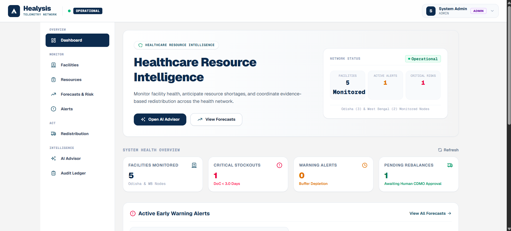
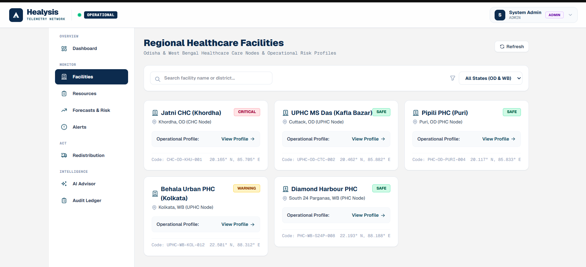
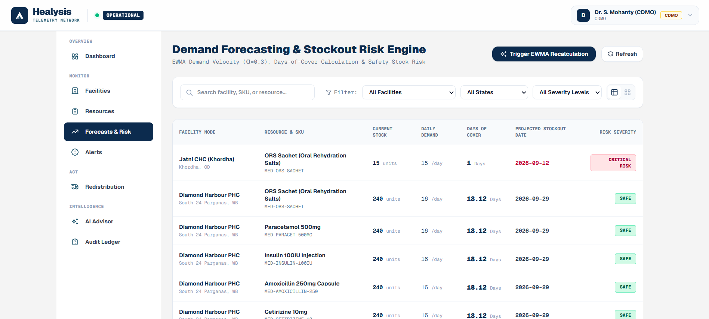
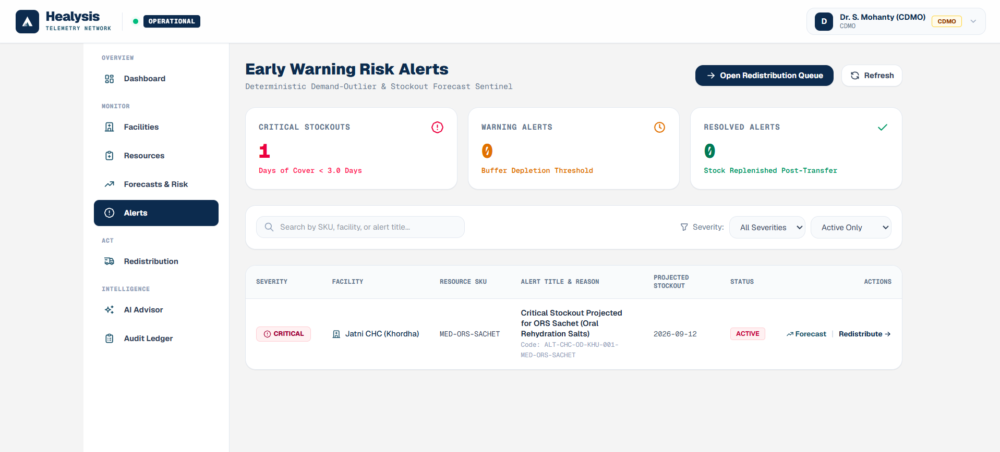
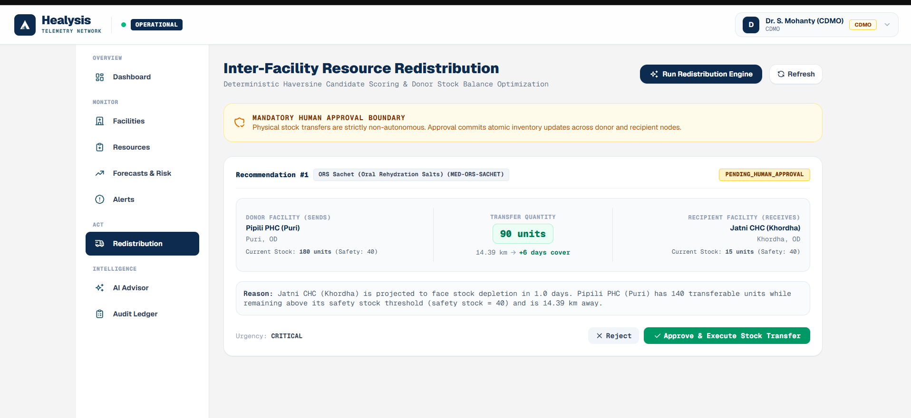

# 🏥 Healysis Sentry Network

<p align="center">
  <strong>AI-Powered Health Supply Chain Resilience for India's Primary Healthcare Network.</strong>
</p>

<p align="center">
  A healthcare operations platform for inventory visibility, demand forecasting, stockout early warning, cross-facility redistribution, human approval workflows, auditability, and grounded Google Gemini assistance.
</p>

<p align="center">


</p>

---

## 📌 Overview

Healthcare facilities can face medicine shortages even when usable stock exists elsewhere in the network. Current stock alone is not enough: health administrators need visibility into **demand, safety stock, days of cover, projected stockout dates, facility risk, alerts, and redistribution options**.

**Healysis Sentry Network** provides a centralized operational intelligence layer for healthcare supply-chain resilience.

The platform combines:

- Facility and district-level operational data
- Inventory and resource visibility
- EWMA-based demand forecasting
- Days-of-cover and projected stockout calculations
- Deterministic stockout-risk classification
- Early-warning alerts
- Cross-facility redistribution recommendations
- Mandatory human approval for physical stock transfers
- Firebase authentication and server-side RBAC
- Audit logging and operational traceability
- Google Gemini-powered grounded AI assistance

> **Core principle:** deterministic backend calculations establish the operational state; Gemini explains verified operational data in natural language.

---

## 🎯 Problem

Primary healthcare networks can experience:

- Uneven distribution of essential medicines across facilities
- Limited visibility into which resources are approaching stockout
- Reactive rather than forecast-driven replenishment
- Difficulty identifying suitable donor facilities
- Manual coordination of inter-facility transfers
- Risk of acting on incomplete or unverified information
- Weak traceability around operational decisions

Healysis addresses these problems by connecting **inventory → forecasting → risk detection → recommendation → human approval → inventory update → recalculation → audit** in one workflow.

---

## 💡 Solution

Healysis continuously represents the operational state of healthcare facilities and resources.

For each resource, the system can track:

| Signal | Purpose |
|---|---|
| Current stock | Available inventory |
| Safety stock | Minimum operational buffer |
| Daily demand | Consumption velocity |
| Days of cover | Estimated remaining supply |
| Projected stockout | Expected depletion date |
| Risk severity | Safe / warning / critical state |
| Alerts | Conditions requiring attention |
| Redistribution options | Potential donor-to-recipient transfers |

This allows a health administrator to move from **“What is happening?”** to **“What is likely to happen?”** and then to **“What action can be taken?”**

---

## ✨ Repository Highlights

- ✅ Google Gemini-powered grounded AI Advisor
- ✅ EWMA demand forecasting
- ✅ Deterministic days-of-cover and stockout-risk calculations
- ✅ Facility and resource inventory visibility
- ✅ Early-warning alerts
- ✅ Cross-facility redistribution recommendations
- ✅ Mandatory human-in-the-loop approval
- ✅ Post-approval inventory and forecast/risk reconciliation
- ✅ Firebase authentication with server-side RBAC
- ✅ Audit logging for operational traceability
- ✅ PostgreSQL production architecture with local SQLite fallback
- ✅ Production frontend and backend deployment

---

## 🧭 Table of Contents

- [Overview](#-overview)
- [Problem](#-problem)
- [Solution](#-solution)
- [Repository Highlights](#-repository-highlights)
- [Key Features](#-key-features)
- [Google Gemini AI](#-google-gemini-ai)
- [End-to-End Workflow](#-end-to-end-workflow)
- [Problem vs Solution](#-problem-vs-solution)
- [System Architecture](#-system-architecture)
- [India-Scale Design](#-india-scale-design)
- [Product Screenshots](#-product-screenshots)
- [Technology Stack](#-technology-stack)
- [Security & Access Control](#-security--access-control)
- [Quality Assurance](#-quality-assurance)
- [Project Structure](#-project-structure)
- [Project Status](#-project-status)
- [Deployment](#-deployment)
- [Installation](#-installation)
- [Quick Start](#-quick-start)
- [Configuration](#-configuration)
- [Troubleshooting](#-troubleshooting)
- [Future Enhancements](#-future-enhancements)
- [License](#-license)
- [Author](#-author)
- [Acknowledgements](#-acknowledgements)

---

# 🚀 Key Features

## 📊 Dashboard

The dashboard provides a network-level operational view of:

- Monitored facilities
- Active alerts
- Critical risks
- Critical stockouts
- Warning conditions
- Pending rebalances
- Early-warning resource conditions

It gives administrators a quick starting point for deciding where attention is needed.

---

## 🏥 Facility Management

Healysis models healthcare facilities across multiple districts and states.

Each facility can expose:

- Facility name
- Facility type
- District and state
- Operational status
- Assigned officer
- Inventory context
- Resource-level risk information

The prototype includes healthcare nodes across **Odisha and West Bengal**.

---

## 📦 Inventory & Resources

Resource records include operational fields such as:

- SKU / item code
- Resource name
- Unit of measure
- Current stock
- Safety stock
- Daily demand
- Days of cover
- Projected stockout date
- Risk severity

This creates the data foundation for forecasting, alerts, AI explanations, and redistribution recommendations.

---

## 📈 Demand Forecasting & Stockout Risk

Healysis uses an **Exponentially Weighted Moving Average (EWMA)** approach to estimate demand velocity.

```text
Historical Demand
       ↓
EWMA Demand Estimate
       ↓
Days of Cover
       ↓
Projected Stockout Date
       ↓
Risk Classification
       ↓
Early Warning Alert
```

The forecasting layer provides deterministic operational values that downstream features can consume.

### Why EWMA?

EWMA gives greater weight to more recent observations while retaining information from earlier observations. This makes it useful for a lightweight operational forecasting baseline where recent demand changes should influence the estimate.

---

## 🚨 Alerts

The Early Warning Alerts view surfaces resources that require operational attention.

The alert workflow connects:

```text
Current Inventory
       ↓
Demand / Forecast
       ↓
Days of Cover
       ↓
Risk Threshold
       ↓
Active Alert
```

When inventory changes after an approved transfer, Healysis reconciles the affected forecast, risk, and alert state.

---

## 🔄 Inter-Facility Redistribution

Healysis can generate candidate redistribution recommendations between facilities.

Example:

```text
Recipient Facility
Low Stock / High Risk
        ↓
Candidate Donor Search
        ↓
Transfer Quantity Recommendation
        ↓
Authorized Human Review
        ↓
Approve / Reject
        ↓
Inventory Update
        ↓
Forecast & Risk Refresh
        ↓
Audit Record
```

### Mandatory Human Approval

Physical stock transfers are **not autonomous**.

The system explicitly maintains a human approval boundary:

> **AI and deterministic engines recommend. Authorized healthcare personnel decide.**

An authorized **CDMO/Director or System Administrator** can approve or reject eligible recommendations.

---

# 🤖 Google Gemini AI

Healysis integrates **Google Gemini 2.5 Flash** as a grounded operational decision-support assistant.

The AI Advisor is designed around a controlled pipeline:

```text
User Question
      ↓
Intent / Entity Resolution
      ↓
Authorization Check
      ↓
Verified Backend Retrieval
      ↓
Deterministic Inventory / Forecast Data
      ↓
Google Gemini
      ↓
Grounded Natural-Language Explanation
```

## AI Advisor Capabilities

The Advisor can answer operational questions such as:

- Which facility currently has the highest stockout risk?
- What resource is causing the risk?
- How many days of cover remain?
- Which facilities require redistribution?
- Which facility has the lowest stock level for a resource?
- What resources are forecast to reach stockout soon?
- What is the likely operational impact of a projected shortage?
- What action is recommended based on the current verified state?

## Grounding Rules

Gemini must not:

- Invent stock quantities
- Invent forecast values
- Invent facilities or resources
- Bypass authorization
- Approve a redistribution
- Execute physical stock transfers
- Expose API keys, credentials, tokens, or internal security data

**Numerical operational truth remains with the backend and deterministic calculations.**

---

# 🔗 End-to-End Workflow

The complete operational path is:

```text
Facility
   ↓
Inventory & Resource State
   ↓
Demand Forecast
   ↓
Days of Cover
   ↓
Stockout Risk
   ↓
Early Warning Alert
   ↓
Redistribution Recommendation
   ↓
Human Approval
   ↓
Inventory Transfer
   ↓
Forecast Refresh
   ↓
Risk Refresh
   ↓
Alert Reconciliation
   ↓
Audit Ledger
```

This provides a functioning end-to-end healthcare resource resilience workflow rather than an isolated AI chatbot.

---

# ⚖️ Problem vs Solution

| Problem | Healysis Solution |
|---|---|
| Limited visibility into distributed stock | Centralized facility and resource dashboard |
| Static stock information does not show future risk | EWMA demand forecasting and days-of-cover calculations |
| Stockouts discovered too late | Projected stockout dates and early-warning alerts |
| Useful stock may exist at another facility | Inter-facility redistribution recommendations |
| Automated transfers can create operational risk | Mandatory authorized human approval |
| Decisions may rely on incomplete information | Grounded AI retrieval from verified backend data |
| Inventory changes can make previous risk states stale | Post-transfer forecast, risk, and alert reconciliation |
| Facility access needs to be controlled | Firebase authentication + server-side RBAC |
| Operational actions need traceability | Audit logging |

---

# 🏗️ System Architecture

```text
                         ┌────────────────────────┐
                         │      Next.js Web UI    │
                         │   React + TypeScript   │
                         └───────────┬────────────┘
                                     │
                                     ▼
                         ┌────────────────────────┐
                         │   Firebase Auth /      │
                         │   Identity Context     │
                         └───────────┬────────────┘
                                     │
                                     ▼
                         ┌────────────────────────┐
                         │    FastAPI Backend     │
                         │   API + Authorization  │
                         └───────────┬────────────┘
                                     │
              ┌──────────────────────┼──────────────────────┐
              ▼                      ▼                      ▼
      ┌───────────────┐      ┌──────────────┐      ┌───────────────┐
      │     RBAC      │      │ PostgreSQL / │      │ Google Gemini │
      │ Scope Checks  │      │ SQLite Local │      │ 2.5 Flash     │
      └───────────────┘      └──────┬───────┘      └───────────────┘
                                    │
                                    ▼
                         ┌────────────────────────┐
                         │ Deterministic Engines  │
                         │ Forecast / Risk /      │
                         │ Alerts / Redistribution│
                         └───────────┬────────────┘
                                     │
                                     ▼
                         ┌────────────────────────┐
                         │ Human Approval Boundary│
                         └───────────┬────────────┘
                                     │
                                     ▼
                         ┌────────────────────────┐
                         │ Inventory + Forecast + │
                         │ Risk + Audit Updates   │
                         └────────────────────────┘
```

---

# 🇮🇳 India-Scale Design

Healysis uses a hierarchical operational model:

```text
State
  ↓
District
  ↓
Healthcare Facility
  ↓
Resource / SKU
  ↓
Demand & Inventory
  ↓
Forecast / Risk
  ↓
Operational Action
```

The prototype demonstrates facilities across **Odisha and West Bengal** while keeping the data model extensible to:

- Additional states
- Additional districts
- PHCs
- CHCs
- UPHCs
- Additional healthcare resources
- Larger demand datasets
- More facilities and administrative users

The architecture separates the frontend, API, database, authentication, and AI layers so the system can scale independently.

---

## Product Screenshots

The repository contains **8 product screenshots** covering the complete user experience.

### Dashboard



Network-level visibility into monitored facilities, active alerts, critical risks, stockouts, and pending rebalances.

### Facilities



Facility-level operational visibility across Odisha and West Bengal, including location and risk status.

### Forecasts & Risk



Deterministic demand forecasting, current stock, daily demand, days of cover, projected stockout dates, and risk severity.

### AI Advisor — Risk Analysis


Grounded Gemini assistance for identifying the highest-risk facility, affected resource, days of cover, and recommended operational action.

### AI Advisor — Inventory Analysis


The Advisor can answer resource-level inventory questions using verified backend data.

### AI Advisor — Forecast Analysis


The Advisor can interpret forecast and stockout-risk information while keeping deterministic numerical values as the source of truth.

### Alerts



Early-warning stockout alerts showing severity, affected facility, resource, projected stockout date, and operational actions.

### Redistribution



Human-approved inter-facility redistribution recommendations with donor/recipient stock, transfer quantity, urgency, and approval controls.

---

# 🧰 Technology Stack

## Frontend

| Technology | Purpose |
|---|---|
| **Next.js 16.3.2** | Web application and routing |
| **React 19** | Component-based UI |
| **TypeScript** | Type-safe frontend development |
| **Tailwind CSS v4** | Interface styling |
| **Recharts** | Data visualization |
| **Lucide / Tabler Icons** | Interface iconography |

## Backend

| Technology | Purpose |
|---|---|
| **Python 3.11+** | Backend runtime |
| **FastAPI** | REST API |
| **Uvicorn** | ASGI server |
| **SQLAlchemy 2.0** | Database ORM |
| **Alembic** | Database migrations |
| **Pydantic v2** | Validation and schemas |
| **SlowAPI** | API rate limiting |

## Data

| Technology | Purpose |
|---|---|
| **PostgreSQL** | Production database |
| **SQLite** | Local development fallback |
| **Realistic seeded data** | Demonstration healthcare network |

## Authentication

| Technology | Purpose |
|---|---|
| **Firebase Authentication** | User authentication |
| **Firebase Admin SDK** | Server-side identity verification |
| **Server-side RBAC** | Role and facility authorization |

## AI

| Technology | Purpose |
|---|---|
| **Google GenAI SDK** | Gemini API integration |
| **Gemini 2.5 Flash** | Grounded operational AI Advisor |

---

# 🔐 Security & Access Control

Healysis applies security controls at the backend boundary.

## Authentication

Firebase Authentication establishes the authenticated user identity.

## Role-Based Access Control

The platform supports:

- **System Administrator**
- **CDMO / Director**
- **Facility Officer**

Authorization is enforced server-side rather than relying on frontend visibility.

## Human Approval Boundary

Redistribution execution requires an authorized approval action. The AI Advisor cannot approve or execute a physical stock transfer.

## Input Validation

Backend schemas validate incoming API payloads before processing.

## Rate Limiting

API rate limiting is enabled for protection against excessive automated requests.

## Secret Isolation

Production credentials and API keys are supplied through environment variables and are not intended to be committed to source control or exposed in the browser.

## Error Sanitization

Internal implementation details and sensitive backend information are not intended to be returned through user-facing API errors.

---

# 🧪 Quality Assurance

Healysis completed production-readiness and end-to-end QA.

## Backend

```text
168 / 168 tests passing
```

Validation included:

- Authentication and RBAC
- Authorization boundaries
- Redistribution approval
- Duplicate approval prevention
- Inventory consistency
- Forecast/risk recalculation
- Alert reconciliation
- AI grounding
- Input validation
- Security regression coverage

## Frontend

```text
Production build successful
13 / 13 application routes validated
TypeScript checks clean
Lint checks clean
```

## Post-Approval Consistency

After an approved transfer, the system validates consistency across:

```text
Donor Stock
      ↓
Recipient Stock
      ↓
Forecast
      ↓
Days of Cover
      ↓
Projected Stockout
      ↓
Risk Severity
      ↓
Alerts
      ↓
Audit Record
```

---

# 📁 Project Structure

```text
healysis-sentry-network/
│
├── backend/
│   ├── app/
│   │   ├── ...
│   │   └── ...
│   ├── alembic/
│   ├── tests/
│   ├── requirements.txt
│   ├── .env.example
│   └── main.py
│
├── frontend/
│   ├── public/
│   ├── src/
│   │   ├── app/
│   │   ├── components/
│   │   ├── lib/
│   │   └── config.ts
│   ├── package.json
│   └── .env.example
│
├── docs/
│   └── Screenshots/
│       ├── dashboard.png
│       ├── facilities.png
│       ├── forecasts-risk.png
│       ├── alerts.png
│       ├── redistribution.png
│       ├── audit-ledger.png
│       ├── ai advisor.png
│       ├── ai advisor2.png
│       └── ai advisor3.png
│
├── .gitignore
├── LICENSE
└── README.md
```

> The structure above highlights the major application areas; individual implementation files may evolve as the project develops.

---

# 🏆 Hackathon Alignment

Healysis is built for the **Smart Health & Supply Chain Resilience** track.

| Hackathon Requirement | Healysis Implementation |
|---|---|
| Functioning end-to-end prototype | Inventory → Forecast → Risk → Alert → Redistribution → Human Approval → Audit |
| Mandatory Google AI | Google Gemini-powered AI Advisor |
| Real / realistic data | Realistic healthcare facility and resource dataset |
| Built for India | Multi-district, multi-state model demonstrated across Odisha and West Bengal |
| Deployable solution | Production frontend and backend deployment |
| Human-centered operation | Authorized human approval for physical redistribution |
| Scalable architecture | Separated frontend, API, database, authentication, and AI layers |

---

# 📊 Project Status

| Area | Status |
|---|---|
| Core product | ✅ Completed |
| Dashboard | ✅ Completed |
| Facility management | ✅ Completed |
| Inventory / resources | ✅ Completed |
| EWMA forecasting | ✅ Completed |
| Stockout risk & alerts | ✅ Completed |
| Redistribution recommendations | ✅ Completed |
| Human approval workflow | ✅ Completed |
| Post-approval reconciliation | ✅ Completed |
| Google Gemini integration | ✅ Completed |
| Firebase authentication / RBAC | ✅ Completed |
| Security & regression QA | ✅ Completed |
| GitHub repository | ✅ Published |
| Live deployment | ✅ Live |
| Demo video | ⏳ Submission asset |
| Pitch deck | ⏳ Submission asset |
| Final submission | ⏳ Pending |

---

# 🌍 Deployment

**Live prototype:** https://healysis.ashlynxcyber.in

Production architecture:

```text
Browser
  ↓
Production Next.js Frontend
  ↓
FastAPI Backend
  ↓
PostgreSQL
  ├── Inventory
  ├── Facilities
  ├── Forecasts
  ├── Alerts
  ├── Recommendations
  └── Audit Data

FastAPI
  ↓
Google Gemini
  ↓
Grounded AI Explanation
```

The frontend and backend are deployed separately, allowing the API and user interface to be maintained and scaled independently.

---

# 💻 Installation

## Prerequisites

| Requirement | Version |
|---|---|
| **Node.js** | 18.18+ or 20+ |
| **Python** | 3.11+ recommended |
| **pip** | Latest |
| **PostgreSQL** | Production deployment |
| **Gemini API Key** | Required for Gemini AI functionality |

For Gemini credentials, use **Google AI Studio**.

---

# ⚡ Quick Start

## Step 1 — Clone the Repository

```bash
git clone https://github.com/Halanaaz1401/healysis-sentry-network.git
cd healysis-sentry-network
```

## Step 2 — Configure Backend

```bash
cd backend

python -m venv .venv
```

### Windows

```bash
.venv\Scripts\activate
```

### Linux / macOS

```bash
source .venv/bin/activate
```

Install dependencies:

```bash
pip install -r requirements.txt
```

Create your local environment file from the supplied template:

```text
backend/.env.example
```

Then configure the required local values.

Start the FastAPI backend:

```bash
uvicorn main:app --reload --port 8000
```

## Step 3 — Configure Frontend

Open another terminal:

```bash
cd frontend
npm install
```

Create the frontend environment file from:

```text
frontend/.env.example
```

For local development, the API base URL should point to the local backend.

Start the frontend:

```bash
npm run dev
```

---

# ⚙️ Configuration

Healysis separates configuration from source code.

## Frontend

The frontend uses:

```text
NEXT_PUBLIC_API_URL
```

For local development, this should point to the local FastAPI service.

For production, it should point to the deployed backend API.

## Backend

The backend environment includes configuration for:

```text
APP_ENV
PROJECT_NAME
ENABLE_DOCS
ALLOW_DEMO_TOKENS
AUTO_SEED
SECRET_KEY
DATABASE_URL
ALLOWED_ORIGINS
GEMINI_API_KEY
GEMINI_MODEL
FIREBASE_PROJECT_ID
FIREBASE_CREDENTIALS_FILE
FIREBASE_CREDENTIALS_JSON
```

> Never commit real credentials, Firebase service-account data, Gemini API keys, database passwords, or production secrets.

Use the supplied `.env.example` files as templates.

---

# 🩺 Operational Decision Model

Healysis deliberately separates **calculation** from **language generation**.

```text
                 OPERATIONAL TRUTH
                       │
        ┌──────────────┼──────────────┐
        ▼              ▼              ▼
    Inventory      Forecast        Risk Rules
        │              │              │
        └──────────────┼──────────────┘
                       ▼
              Verified Backend State
                       │
                       ▼
                  Google Gemini
                       │
                       ▼
             Natural-Language Advice
```

This design reduces the risk of an LLM generating unsupported operational numbers.

---

# 🔄 Redistribution Decision Model

The redistribution workflow follows a controlled sequence:

```text
Risk Detected
     ↓
Eligible Donor / Recipient Analysis
     ↓
Recommendation Generated
     ↓
Human CDMO/Admin Review
     ↓
       ┌───────────────┐
       │               │
    REJECT           APPROVE
       │               │
       ▼               ▼
     Audit       Atomic Inventory Update
                       │
                       ▼
                Forecast Recalculation
                       │
                       ▼
                  Risk Refresh
                       │
                       ▼
                 Alert Reconciliation
                       │
                       ▼
                    Audit
```

The recommendation engine does not directly authorize the transfer.

---

# 🛠️ Troubleshooting

## Frontend cannot connect to backend

Check that:

1. The frontend API base URL is configured correctly.
2. The deployed frontend points to the deployed FastAPI backend.
3. The backend is running and reachable.
4. The backend CORS configuration allows the production frontend origin.
5. Production frontend environment variables were present **before the Next.js build**.

For Next.js client-side variables such as `NEXT_PUBLIC_API_URL`, changing the variable requires a new frontend deployment/build.

## Backend cannot connect to Gemini

Check:

- `GEMINI_API_KEY`
- `GEMINI_MODEL`
- Backend environment configuration
- Network connectivity
- API quota / availability

Never place the Gemini API key in frontend code.

## Local port conflict

If port `8000` is already occupied, use another backend port:

```bash
uvicorn main:app --reload --port 8080
```

Then update the local frontend API URL accordingly.

---

# 🔮 Future Enhancements

Potential future extensions include:

- Larger multi-state healthcare datasets
- Additional forecasting models for comparison
- Automated ingestion from public health supply-chain datasets
- Offline-first synchronization for low-connectivity areas
- Additional regional and language interfaces where required
- Deeper facility-level analytics
- Integration with additional healthcare information systems
- Expanded geospatial optimization for redistribution

These are future directions and are not required for the current prototype.

---

# 📄 License

This project is licensed under the **MIT License**.

See the `LICENSE` file for details.

---

# 👩‍💻 Author

**Hala Naaz**

**Live Platform:** https://healysis.ashlynxcyber.in

**GitHub:** https://github.com/Halanaaz1401

---

# 🙏 Acknowledgements

- **Google AI / Google AI Studio** for Gemini developer access
- **FastAPI** and **Next.js** communities for foundational open-source tooling
- Public-health and healthcare supply-chain workflows that inspired the operational model

---

<p align="center">
  <strong>Healysis Sentry Network</strong><br>
  AI-assisted • Forecast-driven • Human-controlled • Built for healthcare resilience
</p>
