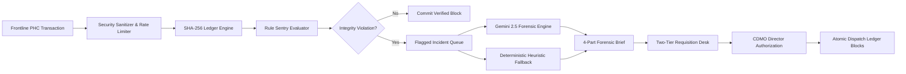

# 🛡️ Healysis Sentry Network

<p align="center">
  <strong>Tamper-Evident Health Telemetry, Cryptographic Ledger & Federated Forensic AI for Primary Health Centres (PHCs).</strong>
</p>

<p align="center">
  A Cryptographic and Neural Supply-Chain Resilience Platform designed to eliminate ghost drawdowns, audit cold-chain excursions, and orchestrate two-tier stock rebalancing across district health networks.
</p>

---

<p align="center">


</p>

<p align="center">


</p>

---

## Overview

Primary and Community Health Centres (PHCs and CHCs) form the frontline of healthcare delivery in developing regions. However, remote healthcare supply chains frequently suffer from zero real-time inventory visibility, fraudulent unrecorded stock diversion (*ghost drawdowns*), and temperature-sensitive medicine spoilage. Traditional management relies on manual paper registers, which allow inventory theft to remain undetected while critical patients face life-threatening stockouts of Oral Rehydration Salts (ORS), Insulin, and antibiotics.

The **Healysis Sentry Network** solves this systemic failure by integrating **SHA-256 cryptographic block chaining** with **Google Gemini 2.5 Flash neural forensic triage** and a **Two-Tier CDMO Requisition Desk**.

Instead of trusting mutable local registers, every medicine transaction (*Dispense, Receive, Spoilage*) is cryptographically anchored to a genesis block with mathematical hash sequence verification.

When anomalous activity occurs — such as bulk dispensations registered against minimal patient footfall or missing encounter tokens — the automated Sentry rule engine flags the event. The system immediately initiates a multi-layered forensic response:

- Instant transaction block quarantine
- Cryptographic hash re-verification ($O(N)$ traversal)
- Statistical footfall vs. draw correlation
- Automated 4-part legal forensic brief generation
- Chief District Medical Officer (CDMO) emergency rebalancing directive
- One-click signed audit PDF export
- Real-time district-wide dashboard telemetry

The entire workflow is managed through an interactive Next.js 15 dashboard featuring 5 role-based access control (RBAC) personas across Odisha and West Bengal health clusters.

---

## Repository Highlights

✔ Immutable SHA-256 Cryptographic Ledger
✔ Real-Time Anomaly Scoring Engine (`RULE_GHOST_DISPENSE`, `RULE_BULK_DEPLETION`)
✔ Two-Tier CDMO Requisition & Authorization Desk
✔ Google Gemini 2.5 Flash 4-Part Forensic Brief Generator
✔ Verifiable PDF Audit Export Pipeline
✔ State-Aware Geo-Fenced Natural Language Advisor
✔ Dual-Language Localization (English & हिंदी)
✔ Multi-Layer Security (SQLi, XSS & Prompt Injection Sanitization)

---

## Key Features

### Cryptographic Ledger & Tamper Detection

- Continuous SHA-256 sequential block hashing
- Genesis block anchoring (`GENESIS_ROOT_HEALYSIS_000`)
- One-click hash chain audit engine
- Exact corruption index tracking (`broken_at`) in $O(N)$
- Zero-PII anonymous patient tokenization (`PAT-IN-8921`)

### Real-Time Sentry Anomaly Engine

- Continuous rule-based transaction evaluation
- Ghost drawdown detection (bulk draw with missing encounter token)
- Statistical footfall vs. quantity deviation analysis
- Cold-chain batch excursion and spoilage tracking
- Interactive 1-click anomaly simulator

### Two-Tier CDMO Stock Requisition Desk

- Frontline node emergency request pipeline (`PENDING_APPROVAL`)
- CDMO District Director centralized review inbox
- Cryptographically authorized stock dispatch
- Atomic dual-block ledger generation (source `DISPENSE` + target `RECEIVE`)
- Zero inventory double-spending guarantee

### Neural Forensic AI Pipeline

- Powered by Google Gemini 2.5 / 2.0 Flash
- 4-part structured legal audit dockets:
  1. Executive Incident Classification
  2. Forensic Evidence & Statistical Correlation
  3. Suspected Root Cause Analysis
  4. CDMO Operational Directives
- High-reliability deterministic engine fallback
- Exportable signed forensic audit PDF

### Geo-Fenced Telemetry Advisor

- Real-time natural language query terminal
- Live mathematical inventory state evaluation ($\text{Base} + \text{Receive} - \text{Dispense} - \text{Spoilage}$)
- Administrative state boundaries (Odisha vs. West Bengal clusters)
- Pre-set prompt pills for instant risk assessment

### Enterprise Hardening & UI/UX

- Regex defense against SQL injection and XSS attacks
- Hardened LLM jailbreak and prompt injection filter
- Sliding-window rate limiter (30 reqs/min per IP)
- 5 distinct authenticated RBAC user personas
- English & Hindi language toggle

---

## Project Status

**Current Version:** v1.0.0
**Live Platform:** [https://healysis.ashlynxcyber.in](https://healysis.ashlynxcyber.in)
**Status:** Production-Ready Hackathon & Academic Portfolio Project
**Development Status:** Completed
**Last Updated:** August 2026

---

## Why This Project?

Traditional healthcare supply chains rely on static, centralized databases or paper registers that can be trivially modified or backdated.

Healysis introduces **mathematical trust and decentralized forensic accountability**. By anchoring every telemetry event in an immutable SHA-256 chain and evaluating live drawdowns using Gemini AI, district health directors can prevent medicine theft in real time rather than discovering stockouts months later during post-mortem audits.

---

## Table of Contents

- [Overview](#overview)
- [Repository Highlights](#repository-highlights)
- [Key Features](#key-features)
- [Project Status](#project-status)
- [Why This Project?](#why-this-project)
- [Problem vs. Solution](#problem-vs-solution)
- [Project Architecture](#project-architecture)
- [System Workflow](#system-workflow)
- [Project Structure](#project-structure)
- [Technology Stack](#technology-stack)
- [Core Design Principles](#core-design-principles)
- [Security Hardening](#security-hardening)
- [Installation](#installation)
- [Quick Start](#quick-start)
- [Running the Complete System](#running-the-complete-system)
- [Configuration](#configuration)
- [Forensic AI Pipeline](#forensic-ai-pipeline)
- [Two-Tier Rebalancing Engine](#two-tier-rebalancing-engine)
- [Troubleshooting](#troubleshooting)
- [Future Enhancements](#future-enhancements)
- [License](#license)
- [Author](#author)
- [Acknowledgements](#acknowledgements)

---

## Problem vs. Solution

| Problem | Healysis Sentry Network Solution |
|---|---|
| Paper-based records with no audit trail | SHA-256 cryptographic ledger — every transaction is hashed and chained, retroactive edits mathematically break the chain |
| Zero real-time inventory visibility | Live geo-fenced dashboard across facilities, districts, and states |
| Medicine stockouts (ORS, Insulin, Paracetamol) | Real-time inventory math (`Base + Receive − Dispense − Spoilage`) with early-warning telemetry |
| Cold-chain vaccine spoilage in ILR units | Spoilage batch tracking built into the ledger and rule engine |
| Gray-market "ghost drawdowns" (high-volume draws vs. near-zero footfall) | `RULE_GHOST_DISPENSE` / `RULE_BULK_DEPLETION` anomaly rules + statistical footfall correlation |
| No accountability for cross-facility stock transfers | Two-tier CDMO requisition desk with atomic dual-block dispatch, zero double-spending |
| Manual, slow incident investigation | Gemini 2.5 Flash generates a structured 4-part forensic brief automatically on every flagged event |

---

## Project Architecture

The Healysis Sentry Network follows an asynchronous, event-driven architecture that separates raw telemetry ingestion, cryptographic block computation, rule sentry scoring, and neural forensic analysis.



---

## System Workflow

```
Frontline Telemetry Input (Facility, Action, SKU, Qty, Footfall, Token)
        │
        ▼
Regex Sanitization & Sliding-Window Rate Limiter
        │
        ▼
SHA-256 Previous Hash Linking (Hn = SHA256(Hn-1 + Payload))
        │
        ▼
Rule Sentry Scoring Engine (Ghost Draw, Bulk Depletion, Spoilage)
        │
        ▼
────────────────────────────────────────────────────────────
Status: Verified (No Rules Triggered)
────────────────────────────────────────────────────────────
Appended to Ledger as VERIFIED Block

────────────────────────────────────────────────────────────
Status: Anomaly Flagged (Severity >= Medium)
────────────────────────────────────────────────────────────
        │
        ▼
Flagged Incident Queued in Cryptographic Ledger
        │
        ▼
Google Gemini 2.5 Flash / Deterministic Fallback
        │
        ▼
Structured 4-Part Forensic Audit Brief Generated
        │
        ▼
CDMO Operational Directives & Verification Mandate
        │
        ▼
One-Click Verifiable Audit PDF Exported
        │
        ▼
Two-Tier Inter-Facility Requisition & Atomic Dispatch
```

---

## Project Structure

```
healysis-sentry-network/
│
├── backend/
│   ├── data/
│   │   └── phc_stock_events.csv      # Persistent SHA-256 transaction ledger
│   ├── engine.py                     # Cryptographic hashing & rule evaluation
│   ├── main.py                       # FastAPI application & Gemini integration
│   ├── requirements.txt              # Python dependency definitions
│   └── .env.example                  # Environment configuration template
│
├── frontend/
│   ├── public/
│   │   └── logo.png                  # Platform branding assets
│   ├── src/
│   │   └── app/
│   │       ├── globals.css           # Tailwind CSS directives
│   │       ├── layout.tsx            # Root layout wrapper
│   │       └── page.tsx              # Complete clinical telemetry dashboard
│   ├── package.json                  # Next.js and frontend dependencies
│   ├── tailwind.config.ts            # Tailwind styling tokens
│   └── tsconfig.json                 # TypeScript compiler configuration
│
├── .gitignore
├── LICENSE
└── README.md
```

---

## Technology Stack

### Frontend Layer

| Technology | Purpose |
|---|---|
| **Next.js 15 (App Router)** | Client interface & server-rendered routing |
| **React 19** | Component-driven UI architecture |
| **TypeScript** | Type-safe schema validation |
| **Tailwind CSS** | Clinical dashboard styling |
| **Tabler Icons React** | Vector iconography |

### Backend & Security

| Technology | Purpose |
|---|---|
| **Python 3.11+** | Backend engine execution |
| **FastAPI** | Asynchronous RESTful telemetry endpoints |
| **Pydantic V2** | Ingestion validation schemas |
| **hashlib (SHA-256)** | Cryptographic hash chaining |
| **Pandas** | Telemetry and historical data manipulation |
| **Uvicorn** | High-performance ASGI server |

### Artificial Intelligence & Telemetry

| Technology | Purpose |
|---|---|
| **Google GenAI SDK** | Gemini 2.5 / 2.0 Flash API interface |
| **Gemini 2.5 Flash** | Multi-variable clinical forensic analysis |
| **Custom Sentry Heuristics** | Deterministic audit generation fallback |

---

## Core Design Principles

### Cryptographic Non-Repudiation

Every transaction payload is hashed sequentially with the previous block's hash. Any retroactive modification breaks all subsequent hashes, immediately identifying tampering.

### Two-Tier Administrative Safeguards

Frontline nodes can never self-authorize inventory transfers. All rebalancing requires CDMO Director sign-off to prevent inventory double-spending.

### Zero-Downtime Deterministic Fallbacks

If external AI connectivity is unavailable, the internal heuristic baseline immediately generates a structured audit brief to avoid operational blind spots.

### Privacy by Design (Zero-PII)

Patient interactions are logged via tokenized encounter strings without storing Aadhaar numbers, phone numbers, or personal identifying data.

---

## Security Hardening

Healysis is built with a "hack-proof by design" posture across every layer of the stack:

| Layer | Protection |
|---|---|
| **Cryptographic Immutability** | SHA-256 block-chaining (`H_n = SHA256(H_{n-1} + Payload)`) anchored to `GENESIS_ROOT_HEALYSIS_000`. Retroactive database row modification mathematically invalidates the entire subsequent chain. |
| **SQLi & XSS Sanitization** | Deep regex filter inspecting all inbound payloads for classic attack patterns (`UNION SELECT`, `OR 1=1`, `<script>`, `onerror=`). |
| **LLM Jailbreak & Prompt Injection Defense** | Dedicated sanitization layer neutralizing system prompt overrides, ignore-instruction vectors, and adversarial tokens before invoking the AI model. |
| **Rate Limiting Sentinel** | Sliding-window memory rate limiter capping requests at 30 req/min per client IP to mitigate automated DDoS, scraping, and brute-force flooding. |
| **Zero-PII Tokenization** | Patient privacy by design — anonymizes all transactions with encounter hashes (e.g., `PAT-IN-8921`), never storing identity data (Aadhaar, contact, name) on-chain. |
| **Secret Boundary Isolation** | Environment variables and API keys strictly quarantined in isolated server environments, never compiled into client-side Next.js bundles or committed to git history. |

---

## Installation

### Prerequisites

| Requirement | Version |
|---|---|
| **Node.js** | v18.18+ or v20+ |
| **Python** | v3.10+ |
| **pip** | Latest |
| **Gemini API Key** | From [Google AI Studio](https://aistudio.google.com/) |

---

## Quick Start

### Step 1 — Clone the Repository

```bash
git clone https://github.com/Halanaaz1401/healysis-sentry-network.git
cd healysis-sentry-network
```

### Step 2 — Configure & Run Backend

```bash
cd backend
python -m venv .venv

# On Windows:
.venv\Scripts\activate
# On Linux/macOS:
# source .venv/bin/activate

pip install -r requirements.txt

# Create environment file
echo GEMINI_API_KEY="your_actual_gemini_api_key_here" > .env

# Start FastAPI Engine (Port 8000)
uvicorn main:app --reload --port 8000
```

### Step 3 — Launch Frontend Dashboard

```bash
# Open a separate terminal window:
cd frontend
npm install
npm run dev
```

---

## Running the Complete System

| Service | Port | Local Endpoint |
|---|---|---|
| **FastAPI Backend** | 8000 | `http://127.0.0.1:8000` |
| **Next.js Dashboard** | 3000 | `http://localhost:3000` |
| **API Documentation** | 8000 | `http://127.0.0.1:8000/docs` |
| **Production Demo** | 443 | `https://healysis.ashlynxcyber.in` |

---

## Configuration

All backend secrets are isolated in a single environment file and never committed to git.

**`backend/.env`**

```
GEMINI_API_KEY=your_actual_gemini_api_key_here
```

- No quotes around the key value
- No trailing whitespace after the key
- `.env` is excluded via `.gitignore` — never commit real credentials
- Use `backend/.env.example` as the template for new environments

---

## Forensic AI Pipeline

When an anomaly is flagged, the system prompts **Gemini 2.5 Flash** with multi-variable parameters to produce an executive brief:

```
1. EXECUTIVE INCIDENT CLASSIFICATION
   - Severity Rating (CRITICAL / HIGH / MEDIUM)
   - Policy & Baseline Breaches

2. FORENSIC EVIDENCE & STATISTICAL CORRELATION
   - Quantity Drawdown vs. Registered Patient Footfall (>3σ deviation)
   - Encounter Token Verification

3. SUSPECTED ROOT CAUSE ANALYSIS
   - Parallel Gray-Market Stock Diversion
   - Unlogged Offline Emergency Dispensation
   - ILR Cold-Chain Batch Spoilage

4. CDMO OPERATIONAL DIRECTIVES
   - Transaction Block Quarantine
   - Block Medical Officer (BMO) Register Audit
   - Inter-District Stock Rebalance Action
```

If the Gemini API is unreachable or rate-limited, the **deterministic heuristic fallback engine** generates an equivalent structured brief with zero downtime, and the full docket can be exported as a signed, printable PDF for district magistrates and health directors.

---

## Two-Tier Rebalancing Engine

1. **Requisition Submission:** Remote clinic selects target item and submits an emergency request (`PENDING_APPROVAL`).
2. **Director Review:** Requisition appears in the CDMO Central Hub console.
3. **Atomic Execution:** On "Authorize & Dispatch", the backend commits two linked SHA-256 blocks:
   - `DISPENSE` at source facility
   - `RECEIVE` at target facility

This guarantees stock transfers are cryptographically balanced across nodes with zero inventory double-spending.

---

## Troubleshooting

### Backend fails to connect to Gemini

Ensure your `backend/.env` file contains `GEMINI_API_KEY=your_key` without quotes and has no trailing spaces.

### Ledger tampering alert appears

Click **"Verify Hash Chain"** in the header. If testing manual tampering, inspect `phc_stock_events.csv` to ensure hashes match sequential outputs.

### Port conflicts

If port 8000 or 3000 is in use:

```bash
uvicorn main:app --reload --port 8080
npm run dev -- -p 3001
```

---

## Future Enhancements

- **Hardware ILR Integration:** Direct IoT temperature sensor hooks for automated cold-chain excursion logging.
- **Offline Mesh Sync:** Bluetooth/Wi-Fi Direct peer-to-peer ledger sync for remote areas without internet.
- **Federated Zero-Knowledge Proofs (ZKPs):** Verifying multi-district quotas without disclosing clinic-specific patient counts.

---

## License

This project is licensed under the **MIT License** - see the `LICENSE` file for details.

---

## Author

**Hala Naaz**

Platform: [https://healysis.ashlynxcyber.in](https://healysis.ashlynxcyber.in)

GitHub: [https://github.com/Halanaaz1401](https://github.com/Halanaaz1401)

---

## Acknowledgements

- **Google AI Studio** for Gemini 2.5 / 2.0 Flash developer access.
- **FastAPI & Next.js Communities** for foundational open-source toolkits.
- **Public Health Administrations** of Odisha and West Bengal for inspirational clinical telemetry workflows.
