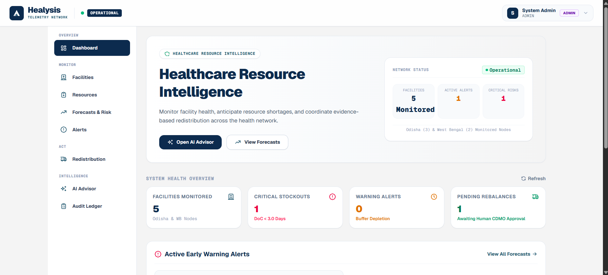
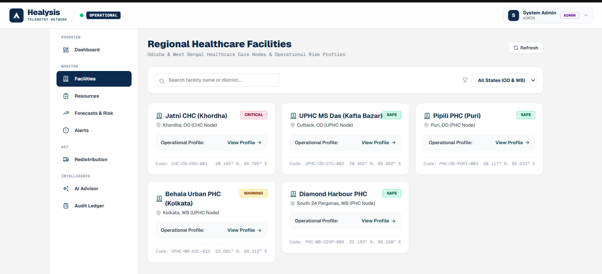
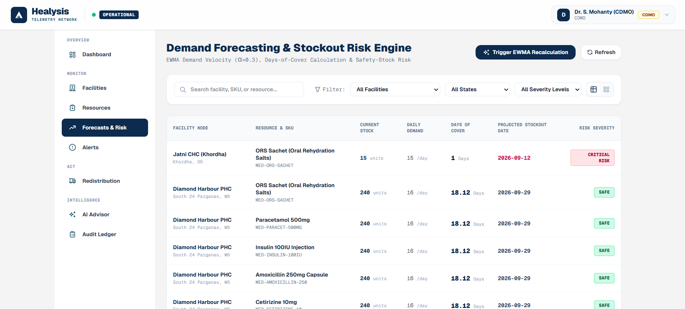
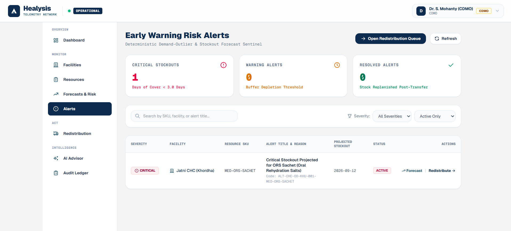
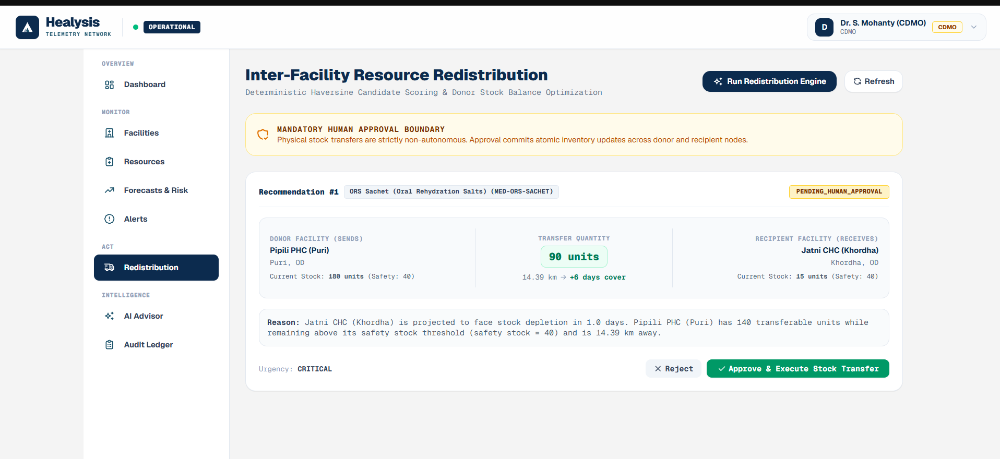
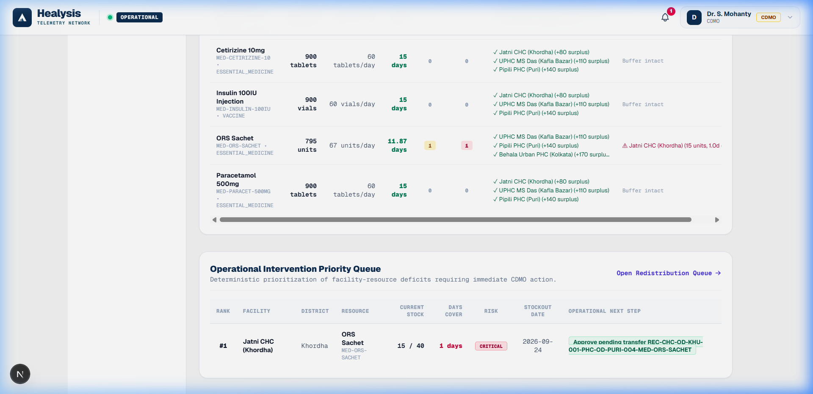

# 🏥 Healysis Sentry Network

<p align="center">
  <strong>AI-Powered Healthcare Supply-Chain Intelligence & Resilience Platform</strong><br>
  Built for India's Primary Healthcare Network
</p>

<p align="center">


</p>

---

## 📌 Overview

Healthcare facilities in India can face critical medicine shortages even when usable stock exists at nearby facilities. Current stock numbers alone are not enough — administrators need **demand forecasting, stockout-risk detection, redistribution recommendations, and a human-controlled approval workflow** backed by auditable data.

**Healysis Sentry Network** is a full-stack healthcare supply-chain intelligence platform that connects:

> **Inventory → Forecasting → Stockout Risk → Early-Warning Alerts → Redistribution Recommendation → Human Approval → Inventory Transfer → Forecast Refresh → Risk Reconciliation → Audit Ledger**

The platform uses **Google Gemini 2.5 Flash** as a grounded AI Advisor that explains verified operational data in concise, natural-language responses — without inventing numbers or bypassing authorization.

> **Core principle:** Deterministic backend calculations establish operational truth. Gemini explains it. Authorized humans decide.

---

## 🧭 Table of Contents

- [Overview](#-overview)
- [Problem Statement](#-problem-statement)
- [Solution](#-solution)
- [Key Features](#-key-features)
- [Google Gemini AI Advisor](#-google-gemini-ai-advisor)
- [End-to-End Workflow](#-end-to-end-workflow)
- [System Architecture](#-system-architecture)
- [Product Screenshots](#-product-screenshots)
- [Technology Stack](#-technology-stack)
- [Security & Access Control](#-security--access-control)
- [Quality Assurance](#-quality-assurance)
- [Project Structure](#-project-structure)
- [Installation & Quick Start](#-installation--quick-start)
- [Configuration](#-configuration)
- [Deployment](#-deployment)
- [India-Scale Design](#-india-scale-design)
- [Future Enhancements](#-future-enhancements)
- [Team](#-team)
- [Acknowledgements](#-acknowledgements)

---

## 🎯 Problem Statement

Primary healthcare networks in India face:

| Challenge | Impact |
|---|---|
| Uneven distribution of essential medicines | Facilities stockout while others hold surplus |
| No visibility into future risk | Shortages discovered only after depletion |
| Reactive replenishment | Delayed intervention, patient care disruption |
| Manual coordination of inter-facility transfers | Slow, error-prone, unaudited |
| Decisions based on incomplete information | Risk of acting on stale or fabricated data |
| Weak operational traceability | No audit trail for supply-chain decisions |

---

## 💡 Solution

Healysis continuously models the operational state of every facility and resource in the network.

| Signal | Purpose |
|---|---|
| Current Stock | Available inventory at each facility |
| Safety Stock | Minimum operational buffer threshold |
| Daily Demand (EWMA) | Consumption velocity estimate |
| Days of Cover | Estimated remaining supply duration |
| Projected Stockout Date | Expected depletion date |
| Risk Severity | Safe → Warning → Critical classification |
| Early-Warning Alerts | Conditions requiring operational attention |
| Redistribution Options | Donor → Recipient transfer recommendations |

This enables administrators to move from **"What is happening?"** → **"What is likely to happen?"** → **"What action should be taken?"**

| Problem | Healysis Solution |
|---|---|
| Limited visibility into distributed stock | Centralized facility and resource dashboard |
| Static stock doesn't show future risk | EWMA demand forecasting and days-of-cover |
| Stockouts discovered too late | Projected stockout dates and early-warning alerts |
| Useful stock may exist elsewhere | Inter-facility redistribution recommendations |
| Automated transfers create operational risk | Mandatory authorized human approval |
| Decisions rely on incomplete data | Grounded AI retrieval from verified backend state |
| Previous risk states become stale after transfers | Post-transfer forecast, risk, and alert reconciliation |
| Facility access needs control | Firebase authentication + server-side RBAC |
| Operational actions need traceability | Immutable audit ledger |

---

## ✨ Key Features

### 📊 Dashboard

Network-level operational command center showing monitored facilities, active alerts, critical risks, warning conditions, pending rebalances, and early-warning resource counts.

### 🏥 Facility Management

Multi-district, multi-state facility modeling across **Odisha and West Bengal**, including facility name, type, district, state, operational status, assigned officer, and resource-level risk context.

### 📦 Inventory & Resource Tracking

Per-resource operational records: SKU/item code, resource name, unit of measure, current stock, safety stock, daily demand, days of cover, projected stockout date, and risk severity.

### 📈 EWMA Demand Forecasting & Stockout Risk

**Exponentially Weighted Moving Average (EWMA)** demand estimation → Days of Cover → Projected Stockout Date → Risk Classification → Early-Warning Alert. EWMA prioritizes recent demand while retaining historical context for lightweight operational forecasting.

### 🚨 Early-Warning Alerts

Automated alerts when resources approach critical thresholds. Alerts reconcile automatically after approved transfers update inventory.

### 🔄 Inter-Facility Redistribution

Candidate redistribution recommendations between donor and recipient facilities. Includes transfer quantity, urgency, distance, estimated time, and an interactive geospatial transfer logistics map built with OpenStreetMap tile rendering.

### ✅ Mandatory Human Approval

Physical stock transfers are **never autonomous**. Authorized **CDMO/Director or System Administrator** personnel must explicitly approve or reject each recommendation.

> **AI and deterministic engines recommend. Authorized healthcare personnel decide.**

### 📋 Audit Ledger

Immutable record of every approval, rejection, inventory update, and operational decision — capturing the acting user, facility context, action type, and timestamp.

### 🌐 District & Network Intelligence

Aggregated operational command for district health officers (CDMO) and state administrators:
- Network-wide telemetry: facilities, SKUs, risk counts, inventory, alerts
- District-level breakdowns: Khordha, Puri, Cuttack, Kolkata, South 24 Parganas
- Per-SKU resource intelligence: stock, demand, days of cover, deficit nodes, donors
- Deterministic risk classification: `CRITICAL` / `WARNING` / `STABLE`
- Intervention priority queue ranked by urgency
- RBAC-enforced visibility: global for CDMO/ADMIN, facility-isolated for officers

### 🗣️ Voice Input & Read Aloud

Natural-language voice queries to the AI Advisor with text-to-speech response playback.

### 🌍 Multilingual Query Support

The AI Advisor accepts queries in Hindi, Odia, Bengali, and English, returning responses in natural, conversational language.

---

## 🤖 Google Gemini AI Advisor

Healysis integrates **Google Gemini 2.5 Flash** via the **Google GenAI SDK** as a grounded, facility-aware operational assistant.

### How It Works

```text
User Question (text or voice, any supported language)
      ↓
Intent & Entity Resolution (deterministic classifier)
      ↓
Authorization Check (RBAC + facility scope)
      ↓
Backend Data Retrieval (verified database tools)
      ↓
Deterministic Inventory / Forecast / Risk Data
      ↓
Google Gemini 2.5 Flash
      ↓
Concise Natural-Language Operational Response
```

### Capabilities

The Advisor answers operational questions such as:
- *Which facility has the highest stockout risk?*
- *What resource is causing the risk?*
- *How many days of cover remain for Paracetamol?*
- *Which facilities need redistribution?*
- *What is the lowest stock resource across the network?*
- *What is the recommended action for a projected shortage?*

### Grounding Rules

Gemini is strictly prohibited from:
- Inventing stock quantities, forecast values, facility names, or resource data
- Approving redistribution or executing physical stock transfers
- Bypassing RBAC or authorization boundaries
- Exposing API keys, credentials, tokens, or internal system data

**Numerical operational truth remains with the backend and deterministic calculations.**

### Stock-Intake Confirmation Cards

When a user reports intake (e.g., *"We received 500 units of Paracetamol"*), the Advisor presents a structured confirmation card for explicit human verification before any database update.

### Adversarial & Prompt-Injection Defense

The Advisor is tested against **63 adversarial test cases** including prompt injection attempts, credential extraction, role escalation, and system-prompt override attacks.

---

## 🔗 End-to-End Workflow

```text
Facility
   ↓
Inventory & Resource State
   ↓
Demand Forecast (EWMA)
   ↓
Days of Cover
   ↓
Stockout Risk Classification
   ↓
Early-Warning Alert
   ↓
Redistribution Recommendation
   ↓
Human Approval (CDMO/Admin)
   ↓
Inventory Transfer
   ↓
Forecast Refresh
   ↓
Risk Refresh
   ↓
Alert Reconciliation
   ↓
Audit Ledger
```

This is a **functioning end-to-end healthcare resource resilience workflow** — not an isolated AI chatbot.

---

## 🏗️ System Architecture

```text
                         ┌────────────────────────┐
                         │      Next.js Web UI    │
                         │   React + TypeScript   │
                         └───────────┬────────────┘
                                     │
                                     ▼
                         ┌────────────────────────┐
                         │   Firebase Auth /      │
                         │   Identity Context     │
                         └───────────┬────────────┘
                                     │
                                     ▼
                         ┌────────────────────────┐
                         │    FastAPI Backend     │
                         │   API + Authorization  │
                         └───────────┬────────────┘
                                     │
              ┌──────────────────────┼──────────────────────┐
              ▼                      ▼                      ▼
      ┌───────────────┐      ┌──────────────┐      ┌───────────────┐
      │     RBAC      │      │ PostgreSQL / │      │ Google Gemini │
      │ Scope Checks  │      │ SQLite Local │      │ 2.5 Flash     │
      └───────────────┘      └──────┬───────┘      └───────────────┘
                                    │
                                    ▼
                         ┌────────────────────────┐
                         │ Deterministic Engines  │
                         │ Forecast / Risk /      │
                         │ Alerts / Redistribution│
                         └───────────┬────────────┘
                                     │
                                     ▼
                         ┌────────────────────────┐
                         │ Human Approval Boundary│
                         └───────────┬────────────┘
                                     │
                                     ▼
                         ┌────────────────────────┐
                         │ Inventory + Forecast + │
                         │ Risk + Audit Updates   │
                         └────────────────────────┘
```

---

## 📸 Product Screenshots

### Dashboard


Network-level visibility into monitored facilities, active alerts, critical risks, stockouts, and pending rebalances.

### Facilities


Facility-level operational view across Odisha and West Bengal, including location, type, and risk status.

### Forecasts & Risk


EWMA demand forecasting with current stock, daily demand, days of cover, projected stockout dates, and risk severity.

### AI Advisor — Risk Analysis


Grounded Gemini assistance identifying the highest-risk facility, affected resource, days of cover, and recommended action.

### AI Advisor — Inventory Analysis


Resource-level inventory queries answered with verified backend data.

### AI Advisor — Forecast Analysis


Forecast and stockout-risk interpretation grounded in deterministic backend calculations.

### Alerts


Early-warning stockout alerts showing severity, affected facility, resource, projected stockout date, and operational actions.

### Redistribution


Human-approved inter-facility redistribution with donor/recipient stock, transfer quantity, urgency, and geospatial logistics map.

### District & Network Intelligence


Multi-state healthcare supply-chain telemetry with district-level breakdowns, risk classification, and intervention priorities.

---

## 🧰 Technology Stack

### Frontend

| Technology | Version | Purpose |
|---|---|---|
| Next.js | 16.3.2 | Web application framework and routing |
| React | 19 | Component-based UI |
| TypeScript | — | Type-safe frontend development |
| Tailwind CSS | v4 | Utility-first styling |
| Recharts | 3.x | Data visualization and charts |
| Tabler Icons | 3.x | Interface iconography |

### Backend

| Technology | Version | Purpose |
|---|---|---|
| Python | 3.11+ | Backend runtime |
| FastAPI | ≥0.110 | REST API framework |
| Uvicorn | ≥0.28 | ASGI server |
| SQLAlchemy | 2.0 | Database ORM |
| Alembic | ≥1.13 | Database migrations |
| Pydantic | v2 | Validation and schemas |
| SlowAPI | ≥0.1.9 | API rate limiting |

### Data

| Technology | Purpose |
|---|---|
| PostgreSQL | Production database |
| SQLite | Local development fallback |
| Realistic seeded data | Demonstration healthcare network |

### Authentication

| Technology | Purpose |
|---|---|
| Firebase Authentication | User identity |
| Firebase Admin SDK | Server-side identity verification |
| Server-side RBAC | Role and facility authorization enforcement |

### AI

| Technology | Purpose |
|---|---|
| Google GenAI SDK | Gemini API integration |
| Gemini 2.5 Flash | Grounded operational AI Advisor |

### Mapping

| Technology | Purpose |
|---|---|
| OpenStreetMap Tiles | Geospatial redistribution transfer logistics map |
| Canvas-based rendering | Custom route visualization, markers, and labels |

---

## 🔐 Security & Access Control

### Authentication
Firebase Authentication establishes the authenticated user identity. All protected endpoints verify tokens server-side via Firebase Admin SDK.

### Role-Based Access Control (RBAC)
Three roles enforced server-side:
- **System Administrator** — Full platform access
- **CDMO / Director** — Network-wide operational access, approval authority
- **Facility Officer** — Scoped to assigned facility only

Authorization is enforced at the API layer, independently of the frontend.

### Facility-Level Isolation
Facility Officers are scoped to their assigned facility. Cross-facility data access attempts return `HTTP 403 Forbidden`.

### Human Approval Boundary
Redistribution execution requires an explicit authorized approval action. The AI Advisor cannot approve or execute physical stock transfers.

### Additional Controls
- **Input Validation** — Pydantic v2 schema validation on all API payloads
- **Rate Limiting** — SlowAPI protection against automated abuse
- **Secret Isolation** — Credentials via environment variables, never committed to source
- **Error Sanitization** — Internal details are not exposed in user-facing API errors
- **Prompt-Injection Defense** — 63 adversarial test cases validating AI safety boundaries

---

## 🧪 Quality Assurance

### Backend Test Suite

```text
430 / 430 tests passing  •  100% pass rate  •  27 test modules
```

Coverage areas:
- Authentication acceptance and rejection paths
- RBAC enforcement across all three roles
- Facility-level isolation and scoping
- Redistribution approval workflow
- Duplicate approval prevention
- Post-approval inventory consistency
- Forecast/risk recalculation after transfers
- Alert reconciliation
- AI Advisor grounding and tool-calling validation
- Adversarial prompt-injection defense (63 test cases)
- Input validation and rate limiting
- Notify → Acknowledge → Escalate SLA workflow
- Deterministic what-if simulation
- Before/after verification
- District and network intelligence
- Voice endpoint validation
- Security regression coverage

### Frontend

```text
Production build successful
10 application routes validated
TypeScript checks clean
```

### Post-Approval Consistency

After every approved transfer, the system validates:

```text
Donor Stock → Recipient Stock → Forecast → Days of Cover → Projected Stockout → Risk Severity → Alerts → Audit Record
```

---

## 📁 Project Structure

```text
healysis-sentry-network/
│
├── backend/
│   ├── app/
│   │   ├── advisor_service.py        # AI Advisor: intent detection, Gemini integration, grounding
│   │   ├── advisor_tools.py          # Gemini function-calling tool definitions
│   │   ├── algorithms.py             # EWMA forecasting, risk classification, redistribution
│   │   ├── config.py                 # Backend configuration and environment
│   │   ├── database.py               # SQLAlchemy database setup
│   │   ├── explainability.py         # AI explainability and reasoning traces
│   │   ├── models.py                 # SQLAlchemy ORM models
│   │   ├── network_intelligence_service.py  # District and network aggregation
│   │   ├── notification_service.py   # Alert notification and SLA workflow
│   │   ├── schemas.py                # Pydantic v2 request/response schemas
│   │   ├── security.py               # Firebase auth, RBAC, facility scoping
│   │   ├── simulation_service.py     # Deterministic what-if simulation
│   │   ├── verification_service.py   # Before/after verification engine
│   │   └── routers/                  # FastAPI route modules
│   ├── alembic/                      # Database migration scripts
│   ├── tests/                        # 27 test modules (430 tests)
│   ├── main.py                       # Application entry point
│   ├── requirements.txt              # Python dependencies
│   └── .env.example                  # Environment variable template
│
├── frontend/
│   ├── src/
│   │   ├── app/
│   │   │   ├── dashboard/            # Network overview dashboard
│   │   │   ├── facilities/           # Facility management
│   │   │   ├── resources/            # Inventory and resource tracking
│   │   │   ├── forecasts/            # Demand forecasting and risk
│   │   │   ├── alerts/               # Early-warning alerts
│   │   │   ├── recommendations/      # Redistribution recommendations
│   │   │   ├── advisor/              # AI Advisor chat interface
│   │   │   ├── network/              # District and network intelligence
│   │   │   ├── audit/                # Audit ledger
│   │   │   └── login/                # Authentication
│   │   ├── components/
│   │   │   ├── AppShell.tsx          # Application layout and navigation
│   │   │   └── GoogleMapsRouteViewer.tsx  # Geospatial transfer logistics map
│   │   ├── lib/                      # Shared utilities
│   │   └── config.ts                 # Frontend configuration
│   ├── package.json
│   └── .env.example
│
├── docs/
│   └── Screenshots/                  # 9 product screenshots
│
└── README.md
```

---

## 💻 Installation & Quick Start

### Prerequisites

| Requirement | Version |
|---|---|
| Node.js | 18.18+ or 20+ |
| Python | 3.11+ |
| pip | Latest |
| PostgreSQL | Production (optional — SQLite used locally) |
| Gemini API Key | Required — obtain from [Google AI Studio](https://aistudio.google.com) |

### Step 1 — Clone

```bash
git clone https://github.com/Halanaaz1401/healysis-sentry-network.git
cd healysis-sentry-network
```

### Step 2 — Backend

```bash
cd backend
python -m venv .venv
```

Activate the virtual environment:

```bash
# Windows
.venv\Scripts\activate

# Linux / macOS
source .venv/bin/activate
```

Install dependencies and start:

```bash
pip install -r requirements.txt
cp .env.example .env    # then configure your local values
uvicorn main:app --reload --port 8000
```

### Step 3 — Frontend

```bash
cd frontend
npm install
cp .env.example .env.local    # then configure API URL
npm run dev
```

The frontend should now be running at `http://localhost:3000` and connecting to the backend at `http://localhost:8000`.

---

## ⚙️ Configuration

### Frontend Environment

```text
NEXT_PUBLIC_API_URL     # Backend API base URL (e.g., http://localhost:8000 for local)
```

> For production, this must point to the deployed FastAPI backend. `NEXT_PUBLIC_*` variables are baked at build time.

### Backend Environment

```text
APP_ENV                 # development / production
PROJECT_NAME            # Application name
ENABLE_DOCS             # Enable/disable Swagger docs
ALLOW_DEMO_TOKENS       # Enable demo auth tokens (development only)
AUTO_SEED               # Auto-seed demonstration data
SECRET_KEY              # Application secret
DATABASE_URL            # PostgreSQL connection string (or sqlite:// for local)
ALLOWED_ORIGINS         # CORS allowed origins
GEMINI_API_KEY          # Google Gemini API key
GEMINI_MODEL            # Gemini model identifier (gemini-2.5-flash)
FIREBASE_PROJECT_ID     # Firebase project ID
FIREBASE_CREDENTIALS_FILE   # Path to Firebase service account JSON
FIREBASE_CREDENTIALS_JSON   # Inline Firebase credentials (alternative)
```

> ⚠️ **Never commit** real credentials, Firebase service-account data, Gemini API keys, database passwords, or production secrets. Use `.env.example` files as templates.

---

## 🌍 Deployment

**Live prototype:** [https://healysis.ashlynxcyber.in](https://healysis.ashlynxcyber.in)

```text
Browser → Production Next.js Frontend → FastAPI Backend → PostgreSQL
                                              ↓
                                       Google Gemini 2.5 Flash
```

The frontend and backend are deployed separately, allowing the API and user interface to scale independently.

---

## 🇮🇳 India-Scale Design

Healysis uses a hierarchical operational model designed for India's healthcare administrative structure:

```text
State → District → Healthcare Facility → Resource/SKU → Demand & Inventory → Forecast/Risk → Operational Action
```

The prototype demonstrates facilities across **Odisha** (Khordha, Puri, Cuttack) and **West Bengal** (Kolkata, South 24 Parganas).

The architecture is designed to extend to:
- Additional states, districts, and facility types (PHC, CHC, UPHC)
- Additional healthcare resources and larger demand datasets
- More administrative users and facility officers

---

## 🔮 Future Enhancements

- Larger multi-state healthcare datasets
- Additional forecasting models (e.g., ARIMA, Prophet) for comparison
- Automated ingestion from public health supply-chain datasets
- Offline-first synchronization for low-connectivity rural areas
- Expanded regional language interfaces
- Deeper facility-level analytics dashboards
- Integration with external healthcare information systems
- Advanced geospatial optimization for redistribution routing

---

## 👥 Team

| Name | Role | Contributions |
|---|---|---|
| **Hala Naaz** | AI & Full-Stack Lead | Platform architecture, backend API, AI Advisor (Gemini integration, grounding, intent classification, tool-calling), demand forecasting, redistribution engine, frontend UI, deployment |
| **Ashraf Sami Mohammed** | Security & QA Lead | Authentication testing, RBAC enforcement validation, facility isolation testing, AI Advisor adversarial/prompt-injection defense, cybersecurity assessment, security regression test suite |

---

## 🙏 Acknowledgements

- **Google AI / Google AI Studio** — Gemini 2.5 Flash developer access and the Google GenAI SDK
- **FastAPI** and **Next.js** communities — Foundational open-source tooling
- **OpenStreetMap** contributors — Map tile data for geospatial visualization
- Public-health and healthcare supply-chain workflows that inspired the operational model

---

<p align="center">
  <strong>Healysis Sentry Network</strong><br>
  AI-assisted • Forecast-driven • Human-controlled • Auditable • Built for healthcare resilience
</p>
