# Healysis Sentry Network

<p align="center">
  
  
  
</p>

<p align="center">
  <strong>AI-assisted healthcare supply-chain intelligence for India</strong><br />
  Making medicine shortages visible, predictable, and actionable.
</p>

<p align="center">
  <a href="https://healysis.ashlynxcyber.in">Live Prototype</a> •
  <a href="https://github.com/Halanaaz1401/healysis-sentry-network">GitHub Repository</a>
</p>

<p align="center">
  <strong>Built by Hala Naaz × Ashraf Sami Mohammed</strong>
</p>

---

## About Healysis

**Healysis Sentry Network** is an AI-assisted healthcare supply-chain intelligence platform designed to help health administrators monitor medicine availability, detect stockout risk early, identify redistribution opportunities, and verify what happens after an authorized stock transfer.

Instead of looking at inventory as isolated facility records, Healysis connects **inventory, demand, risk, alerts, redistribution, human approval, verification, and auditability** into one operational workflow.

### The core idea

> **See the shortage → understand the risk → find available stock → act with authorization → verify the outcome.**

---

## The Problem

Healthcare facilities can experience shortages even when usable stock is available elsewhere in the network.

Common operational gaps include:

- Uneven distribution of essential medicines
- Limited facility-level inventory visibility
- Difficulty identifying approaching stockouts
- Reactive replenishment instead of forecast-driven intervention
- Manual identification of potential donor facilities
- Slow coordination of inter-facility transfers
- Decisions made without a single operational view
- Limited traceability after an intervention

The real challenge is not simply **"How much stock exists?"**

It is:

> **Where is the shortage, how urgent is it, is stock available elsewhere, and what should an authorized administrator do next?**

---

## Our Solution

Healysis turns facility inventory data into a practical decision-support workflow.

```text
Inventory
    ↓
Demand & Forecast
    ↓
Stockout Risk
    ↓
Early Warning
    ↓
Redistribution Recommendation
    ↓
Human Approval
    ↓
Inventory Update
    ↓
Verification & Audit
    ↓
AI Explanation
```

The platform is designed around **human-in-the-loop operations**. The AI can explain verified information, but it does not independently approve or execute a physical stock transfer.

---

# Key Features

## 1. Operational Dashboard

A centralized view of monitored facilities, inventory conditions, critical resources, risk levels, alerts, forecasts, and redistribution activity.

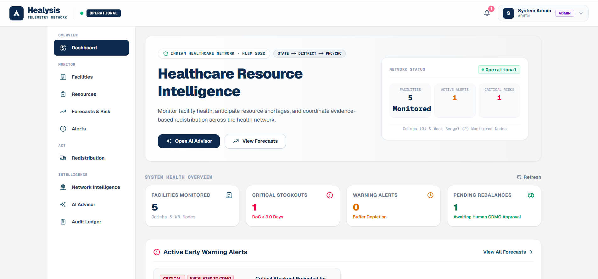

---

## 2. Facility & Network Visibility

View facility-level information including location, district, operational status, monitored resources, inventory state, and risk condition.

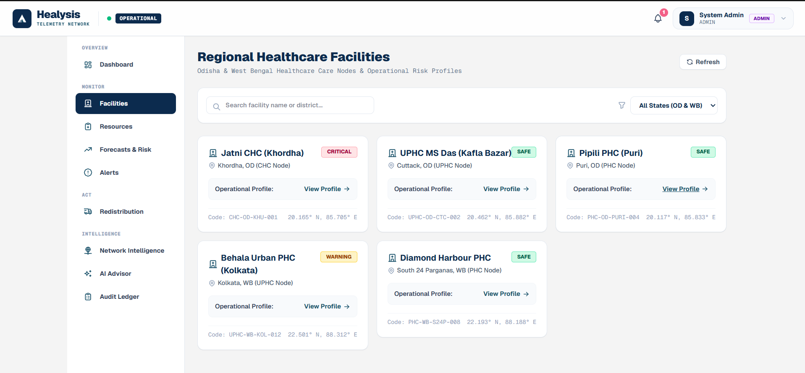

---

## 3. Inventory Monitoring

Track resource-level stock and operational indicators such as:

- Current stock
- Safety stock
- Daily demand
- Days of cover
- Projected stockout
- Risk classification

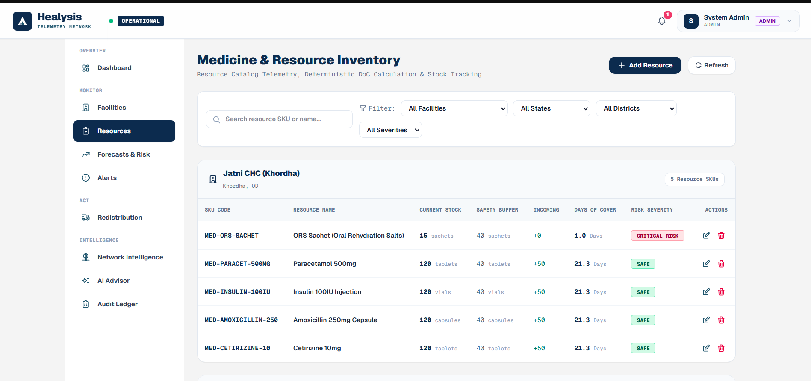

---

## 4. Forecasts & Stockout Risk

Healysis uses **Exponentially Weighted Moving Average (EWMA)** demand forecasting to estimate near-term inventory pressure.

```text
Historical Demand
       ↓
EWMA Forecast
       ↓
Days of Cover
       ↓
Projected Stockout
       ↓
Risk Classification
       ↓
Alert / Intervention
```

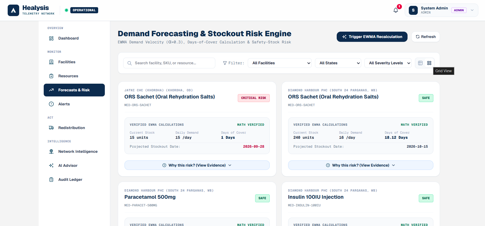

---

## 5. Early-Warning Alerts

Critical inventory conditions and approaching stockouts are surfaced as actionable alerts so administrators can focus on facilities that need attention.

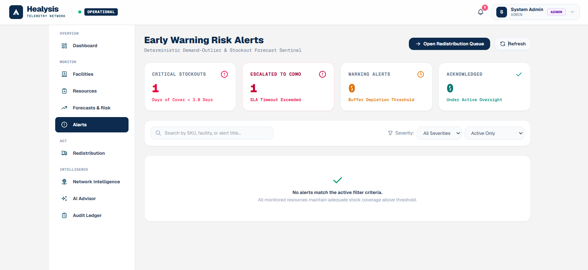

---

## 6. Redistribution Recommendations

When a facility is approaching a shortage, Healysis can identify a suitable donor facility with available surplus and generate a transfer recommendation.

The workflow considers operational factors such as:

- Recipient stock level
- Safety threshold
- Demand
- Donor availability
- Transfer quantity
- Facility locations
- Estimated route distance
- Transit estimate

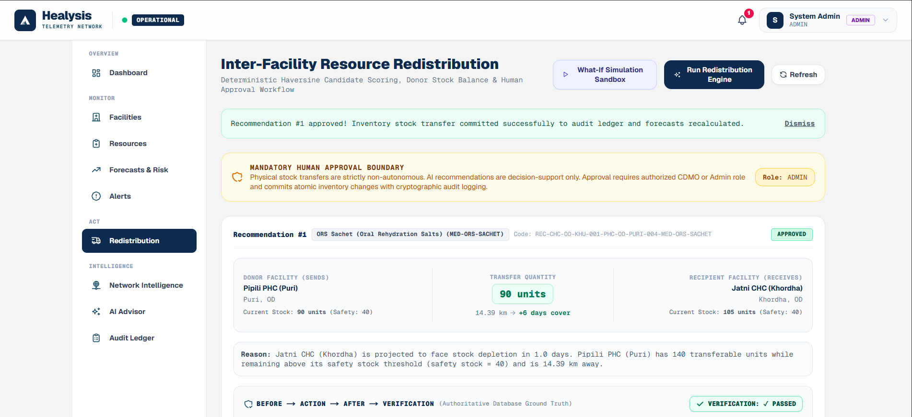

---

## 7. Geospatial Transfer View

The redistribution interface provides a simple operational route visualization showing the donor facility, recipient facility, route corridor, transfer quantity, distance, and estimated transit time.

The visualization is intentionally designed for **clarity and operational use**, rather than as a decorative or overly complex map interface.

---

## 8. Human-in-the-Loop Approval

Recommendations do not automatically become operational transfers.

```text
Recommendation
      ↓
Authorized Review
      ↓
Approve / Reject
      ↓
Verified State Change
      ↓
Audit Record
```

Authorized users remain responsible for the final operational decision.

---

## 9. Before → Action → After → Verification

For an approved transfer, Healysis provides a clear chain of evidence:

- **Before:** recipient stock, donor stock, safety threshold, and risk
- **Action:** approved transfer quantity and audit reference
- **After:** updated recipient and donor inventory
- **Verification:** database state checked against the expected outcome

This makes the intervention traceable instead of treating a recommendation as the end of the workflow.

---

## 10. AI Advisor

Healysis includes a **Google Gemini-powered AI Advisor** for simple operational questions.

The MVP deliberately keeps the AI focused and concise.

### Example questions

- "Which facility is at highest stockout risk?"
- "What is the ORS stock at Pipili PHC?"
- "Which facility has the lowest stock?"
- "What is the current stock at Jatni CHC?"
- "Which resource is critical?"
- "Is there a pending redistribution recommendation?"

### MVP response principle

> **Ask → Retrieve verified data → Answer clearly**

Example:

**Question:** Which facility is at highest stockout risk?

**Expected style:**

> Jatni CHC has the highest stockout risk. It has 15 ORS sachets and about 1 day of cover.

The MVP intentionally avoids generating unnecessary long reports for simple operational questions.

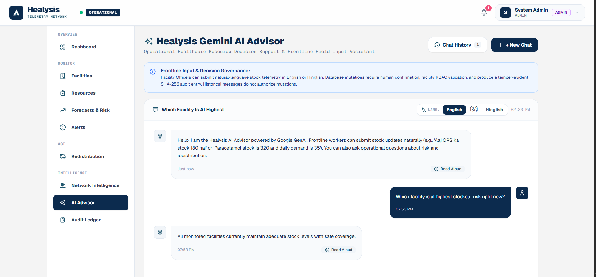

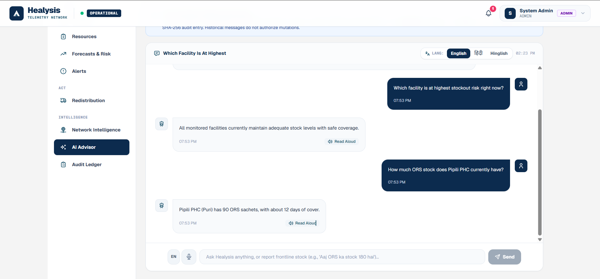

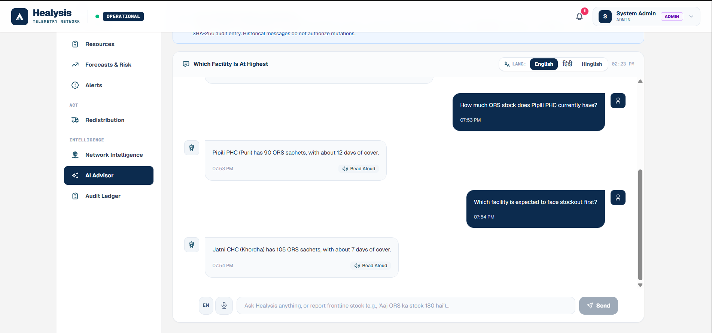

---

## AI Grounding & Security

The AI Advisor is designed to explain verified operational data rather than inventing independent inventory state.

Security testing covered scenarios including:

- Prompt-injection attempts
- Attempts to override system instructions
- Attempts to reveal secrets or internal configuration
- Attempts to bypass authorization through natural language
- Attempts to make the AI approve a transfer
- Inventory grounding checks
- Post-transfer consistency checks

> **AI assists with understanding. Backend authorization controls operational actions.**

---

## Authentication & Access Control

Healysis uses authenticated role-based access for operational workflows.

Supported roles include:

- **System Administrator**
- **CDMO / Director**
- **Facility Officer**

Authorization is enforced on the backend rather than relying only on frontend visibility.

---

## Auditability & Security

The platform includes security and traceability controls such as:

- Firebase authentication
- Server-side RBAC
- Facility-level authorization
- Input validation
- Rate limiting
- Security headers
- Environment-based secret handling
- Prompt-injection defenses
- SHA-256 tamper-evident audit chaining
- Approval/rejection audit records
- Security regression testing

---

## Network Intelligence

Healysis provides a network-level view of operational risk across monitored facilities, including:

- Facility risk distribution
- District-level risk
- Resources at risk
- Critical facilities
- Intervention priorities
- Potential surplus facilities
- Redistribution opportunities

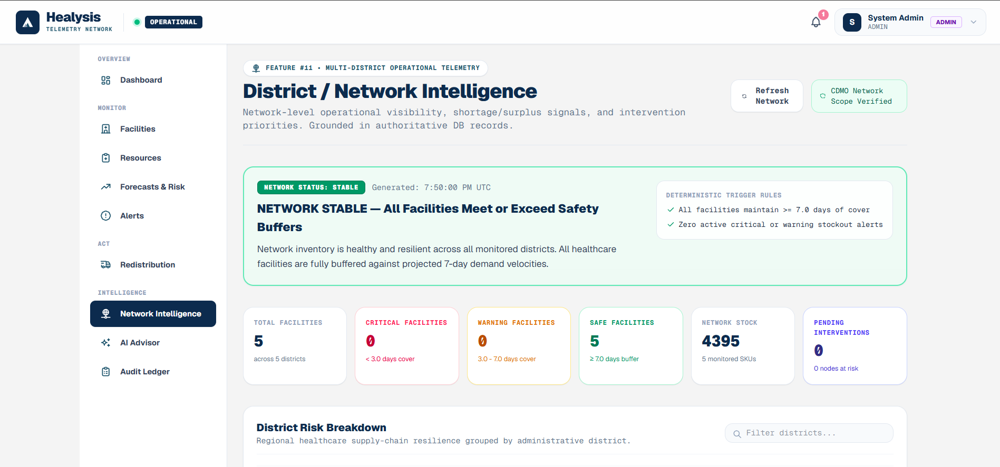

---

# How Healysis Works

```text
Facility Inventory
       ↓
Demand & Consumption
       ↓
Forecast
       ↓
Days of Cover
       ↓
Stockout Risk
       ↓
Alert
       ↓
Redistribution Recommendation
       ↓
Human Approval
       ↓
Inventory Update
       ↓
Recalculation
       ↓
Verification
       ↓
Audit Trail
       ↓
AI Advisor Explanation
```

---

# Architecture

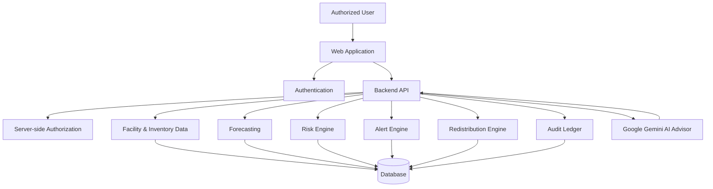
```mermaid
flowchart TD
    User["Authorized User"]
    Frontend["Web Application"]
    Auth["Authentication"]
    API["Backend API"]
    RBAC["Server-side Authorization"]
    Data["Facility & Inventory Data"]
    Forecast["Forecasting"]
    Risk["Risk Engine"]
    Alerts["Alert Engine"]
    Redis["Redistribution Engine"]
    Audit["Audit Ledger"]
    Gemini["Google Gemini AI Advisor"]
    DB[("Database")]

    User --> Frontend
    Frontend --> Auth
    Frontend --> API
    API --> RBAC
    API --> Data
    API --> Forecast
    API --> Risk
    API --> Alerts
    API --> Redis
    API --> Audit
    API --> Gemini
    Data --> DB
    Forecast --> DB
    Risk --> DB
    Alerts --> DB
    Redis --> DB
    Audit --> DB
    Gemini --> API
```

---

# India-Scale Potential

Healysis is designed around a hierarchical healthcare network model:

```text
State
  ↓
District
  ↓
Healthcare Facility
  ↓
Resource / SKU
  ↓
Inventory & Demand
  ↓
Forecast / Risk
  ↓
Operational Action
```

The prototype demonstrates a multi-district network across **Odisha and West Bengal**. The same model can be extended to additional states, districts, PHCs, CHCs, UPHCs, hospitals, resources, users, and data sources.

The objective is to provide a reusable operational layer that can scale from a small district network toward larger state-level and multi-state healthcare supply-chain monitoring.

---

# Technology & Implementation

The project uses a modern web application architecture with:

- **Next.js / React / TypeScript** for the application interface
- **FastAPI / Python** for backend services
- **PostgreSQL / SQLite** for operational data
- **Firebase Authentication** for identity
- **Google Gemini** for the AI Advisor
- **EWMA forecasting** for demand estimation
- **Server-side RBAC** for authorization
- **SHA-256 audit chaining** for traceability
- **Map-based geospatial visualization** for redistribution routes
- **Pytest and browser QA** for validation

> The technology stack supports the product; the primary focus of the MVP is the working healthcare supply-chain workflow.

---

# Project Structure

```text
healysis-sentry-network/
│
├── backend/
│   ├── app/
│   ├── tests/
│   ├── requirements.txt
│   ├── .env.example
│   └── main.py
│
├── frontend/
│   ├── public/
│   ├── src/
│   │   ├── app/
│   │   ├── components/
│   │   └── lib/
│   ├── package.json
│   └── .env.example
│
├── docs/
│   └── Screenshots/
│       ├── healysis-dashboard.png
│       ├── healysis-facilities.png
│       ├── healysis-inventory.png
│       ├── healysis-forecasts-risk.png
│       ├── healysis-alerts.png
│       ├── healysis-redistribution-map.png
│       ├── healysis-ai-advisor-risk.png
│       ├── healysis-ai-advisor-inventory.png
│       ├── healysis-ai-advisor-forecast.png
│       └── healysis-network-intelligence.png
│
├── .gitignore
├── LICENSE
└── README.md
```

---

# Run Locally

## Prerequisites

- Node.js 18.18+ / 20+
- Python 3.11+
- Database configuration
- Firebase credentials for authenticated workflows
- Google Gemini credentials for AI functionality

## Backend

```bash
cd backend
python -m venv .venv
```

### Windows

```powershell
.venv\Scripts\activate
```

### Linux / macOS

```bash
source .venv/bin/activate
```

Install dependencies:

```bash
pip install -r requirements.txt
```

Configure the environment using `backend/.env.example`, then run:

```bash
uvicorn main:app --reload --port 8000
```

## Frontend

```bash
cd frontend
npm install
npm run dev
```

Open:

`http://localhost:3000`

---

# Live Prototype

**https://healysis.ashlynxcyber.in**

The deployed prototype demonstrates the end-to-end operational flow from facility monitoring through risk detection, redistribution, approval, verification, auditability, and AI-assisted querying.

---

# Hackathon Alignment

Healysis addresses the **Smart Health & Supply Chain Resilience** problem area.

| Challenge Need | Healysis Capability |
|---|---|
| Healthcare supply-chain visibility | Facility and resource inventory monitoring |
| Predictive intelligence | EWMA demand forecasting |
| Stockout detection | Deterministic risk calculations |
| Early intervention | Alerts and risk indicators |
| Redistribution | Donor-to-recipient recommendations |
| Human oversight | Authorized approval workflow |
| AI assistance | Grounded Google Gemini Advisor |
| Security | RBAC, validation, rate limiting, audit controls |
| Verification | Before/after transfer reconciliation |
| Deployment | Live prototype |
| India scalability | Multi-district / multi-state data model |

---

# MVP Scope

The MVP focuses on six practical questions:

1. Where is the current shortage?
2. Which facility is at risk?
3. How soon could stock run out?
4. Is usable stock available elsewhere?
5. What redistribution option exists?
6. What happened after the authorized action?

The AI follows the same philosophy:

> **Ask a simple question → retrieve verified data → give a simple answer.**

Advanced report generation and autonomous decision-making are intentionally outside the MVP scope.

---

# Validation & Testing

The final MVP was checked across the core operational workflow, including:

- Authentication
- Role-based access control
- Facility visibility
- Inventory retrieval
- Forecast loading
- Stockout-risk calculation
- Alerts
- Redistribution recommendations
- Approval workflow
- Post-transfer reconciliation
- Audit records
- AI Advisor queries
- AI adversarial-input testing
- Geospatial route interaction
- Responsive UI
- Frontend/backend integration

The project was also reviewed for security issues such as authorization boundaries, input handling, secret exposure, prompt-injection behavior, and operational state consistency.

---

# Current MVP Status

| Area | Status |
|---|---|
| Dashboard | ✅ Completed |
| Facilities | ✅ Completed |
| Inventory / Resources | ✅ Completed |
| Forecasts & Risk | ✅ Completed |
| Alerts | ✅ Completed |
| Redistribution | ✅ Completed |
| Geospatial Route View | ✅ Completed |
| Human Approval Workflow | ✅ Completed |
| Post-Approval Verification | ✅ Completed |
| Audit Ledger | ✅ Completed |
| Google Gemini AI Advisor | ✅ Completed |
| AI Security Testing | ✅ Completed |
| Authentication / RBAC | ✅ Completed |
| Security QA | ✅ Completed |
| Live Deployment | ✅ Live |

---

# Team

## Hala Naaz

**Cybersecurity Professional · AI Security · Generative AI**

Hala Naaz is a cybersecurity professional focused on **AI security, secure AI applications, Generative AI, and product-oriented security engineering**. She led the product direction, application development, AI integration, security design, and overall implementation of Healysis.

## Ashraf Sami Mohammed

**Cybersecurity Professional · VAPT**

Ashraf Sami Mohammed is a cybersecurity professional focused on **Vulnerability Assessment and Penetration Testing (VAPT), application security, security validation, and security testing**. He contributed to the project's security review, testing, validation, and QA activities.

### Built by

**Hala Naaz × Ashraf Sami Mohammed**

---

# Final Hackathon Submission

The submission package contains:

### 1. Source Code

Public GitHub repository:

**https://github.com/Halanaaz1401/healysis-sentry-network**

### 2. Demo Video

A **3–5 minute end-to-end walkthrough** covering the working product flow:

```text
Login
 ↓
Dashboard
 ↓
Inventory / Risk
 ↓
Alert
 ↓
Redistribution
 ↓
Geospatial Route
 ↓
Approval
 ↓
Verification / Audit
 ↓
AI Advisor
```

### 3. Pitch Deck

A **10–12 slide** presentation covering:

- Problem
- Solution
- Product workflow
- AI approach
- Security
- Who it serves
- Why it is deployable
- India-scale potential
- Product screenshots
- Use case / impact
- Demo flow
- Team

### 4. Brief Description

> **Healysis is an AI-assisted healthcare supply-chain intelligence platform that helps health administrators detect medicine stockout risk, identify redistribution opportunities, and verify authorized stock transfers. It combines forecasting, risk intelligence, human approval, auditability, and a grounded Google Gemini AI Advisor in one operational workflow.**

### 5. Deployed Link

**https://healysis.ashlynxcyber.in**

---

# Final Submission Checklist

- [x] Public GitHub repository
- [x] Source code pushed to `main`
- [x] Final README updated
- [x] Core product workflows tested
- [x] Security testing completed
- [x] AI Advisor tested
- [x] Redistribution workflow tested
- [x] Geospatial route UI tested
- [x] Human approval and verification tested
- [x] Live deployment available
- [ ] Final screenshots added to `docs/Screenshots/`
- [ ] 3–5 minute demo video recorded
- [ ] 10–12 slide pitch deck completed
- [ ] Final 2–3 line description added to submission form
- [ ] Deployed URL added to submission form
- [ ] GitHub URL added to submission form
- [ ] Final submission form reviewed

---

# License

This project is released under the **MIT License**, unless otherwise specified by the applicable hackathon rules.

---

<p align="center">
  <strong>Healysis Sentry Network</strong><br />
  AI-assisted healthcare supply-chain intelligence for India.
</p>

<p align="center">
  <strong>Hala Naaz × Ashraf Sami Mohammed</strong>
</p>
