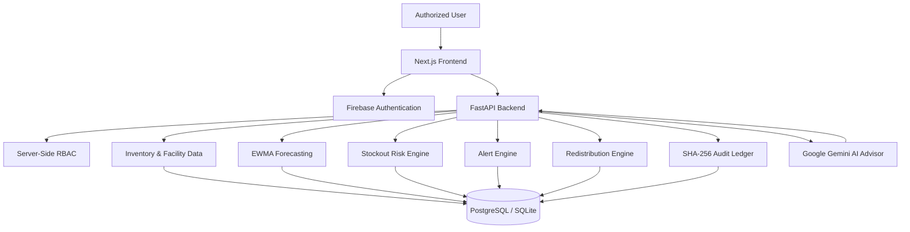

# Healysis Sentry Network

```{=html}
<p align="center">
```
`<strong>`{=html}AI-Powered Healthcare Supply Chain Intelligence for
India`</strong>`{=html}
```{=html}
</p>
```
```{=html}
<p align="center">
```
Inventory Visibility • Forecasting • Stockout Risk • Alerts •
Redistribution • AI Advisor • Auditability
```{=html}
</p>
```
```{=html}
<p align="center">
```
`<a href="https://healysis.ashlynxcyber.in">`{=html}Live
Prototype`</a>`{=html} •
`<a href="https://github.com/Halanaaz1401/healysis-sentry-network">`{=html}GitHub
Repository`</a>`{=html}
```{=html}
</p>
```

------------------------------------------------------------------------

## Overview

**Healysis Sentry Network** is an AI-assisted healthcare supply-chain
intelligence platform designed to help health administrators identify
medicine shortages early, understand facility-level risk, and coordinate
safe redistribution of available stock.

The core operational loop is:

``` text
Inventory → Forecast → Risk → Alert → Recommendation
        → Human Approval → Verification → Audit
```

The prototype demonstrates a multi-facility network across **Odisha and
West Bengal** and is designed to extend to additional states, districts,
facilities, resources, and users.

### 2--3 Line Description

> Healysis is an AI-assisted healthcare supply-chain intelligence
> platform that predicts medicine stockout risk, identifies
> redistribution opportunities, and gives authorized health
> administrators a clear operational view of facility inventory. It
> combines deterministic forecasting and risk calculations with a
> grounded Google Gemini AI Advisor and human-approved stock-transfer
> workflows.

------------------------------------------------------------------------

## Problem

Healthcare facilities can face medicine shortages even when usable stock
exists elsewhere in the network.

Key operational gaps include:

-   Uneven distribution of essential medicines
-   Limited facility-level inventory visibility
-   Difficulty identifying facilities approaching stockout
-   Reactive rather than forecast-driven replenishment
-   Manual identification of potential donor facilities
-   Slow coordination of inter-facility transfers
-   Decisions based on incomplete or unverified information
-   Limited traceability of operational actions

The challenge is not only knowing **how much stock exists**, but also
understanding where the shortage is, how soon it may become critical,
which facilities have usable surplus, and what authorized action can be
taken.

------------------------------------------------------------------------

## Solution

Healysis connects the operational state of healthcare facilities into
one workflow.

  Signal               Purpose
  -------------------- ---------------------------------------
  Current stock        Available inventory
  Safety stock         Minimum operational buffer
  Daily demand         Consumption velocity
  Days of cover        Estimated remaining supply
  Projected stockout   Expected depletion date
  Risk severity        Safe / Warning / Critical
  Alerts               Conditions requiring attention
  Redistribution       Potential donor-to-recipient transfer
  Audit record         Operational traceability

This lets an administrator move from:

**What is happening? → What is likely to happen? → What action can be
taken?**

------------------------------------------------------------------------

# Key Features

## 1. Operational Dashboard

Centralized view of monitored facilities, inventory conditions, critical
resources, forecasts, stockout risks, alerts, and redistribution
activity.


## 2. Facility Management

Facility-level visibility including facility name/type, district/state,
operational status, resources, and risk state.


## 3. Inventory & Resources

Tracks resource/SKU, current stock, safety stock, daily demand, days of
cover, projected stockout, and risk classification.


## 4. Forecasts & Risk

Healysis uses an **Exponentially Weighted Moving Average (EWMA)**
approach for demand forecasting.

``` text
Historical Demand
       ↓
EWMA Forecast
       ↓
Days of Cover
       ↓
Projected Stockout
       ↓
Risk Classification
       ↓
Alert / Operational Action
```


## 5. Early-Warning Alerts

Surfaces resources and facilities that require operational attention,
including critical stock levels and approaching stockouts.


## 6. Redistribution & Geospatial Logistics

Healysis identifies potential donor facilities for facilities facing
shortages.

``` text
Critical Facility
       ↓
Identify Potential Donor
       ↓
Calculate Transfer Quantity
       ↓
Generate Recommendation
       ↓
Authorized Human Review
       ↓
Approve / Reject
       ↓
Inventory Update
       ↓
Forecast & Risk Recalculation
       ↓
Audit Verification
```

The route view provides donor/recipient facilities, corridor, distance,
transit estimate, allocated quantity, target need, and transfer status.


> **Operational boundary:** the AI Advisor does not independently
> execute a physical stock transfer. Redistribution requires an
> authorized human action.

------------------------------------------------------------------------

# Human-in-the-Loop Approval

Operational authority remains with authorized users.

``` text
Recommendation
      ↓
Authorized Review
      ↓
Approve / Reject
      ↓
Verified State Change
      ↓
Audit Record
```

The workflow includes duplicate approval protection, post-transfer
verification, and audit recording. Rejected recommendations do not
modify inventory.

## Before → After Verification

For an approved redistribution, Healysis shows:

-   **Before:** recipient stock, donor stock, safety threshold, risk
    state
-   **Action:** approved transfer, quantity, audit reference
-   **After:** updated recipient stock and remaining donor stock
-   **Verification:** database state and expected inventory outcome

------------------------------------------------------------------------

# Google Gemini AI Advisor

Healysis includes a **Google Gemini-powered AI Advisor** for operational
questions.

The MVP intentionally keeps the AI simple and focused on direct answers.

Example questions:

-   "Which facility is at highest stockout risk?"
-   "What is the ORS stock at Pipili PHC?"
-   "Which facility has the lowest stock?"
-   "What is the current stock at Jatni CHC?"
-   "Which resource is critical?"
-   "What redistribution recommendation is pending?"

### MVP AI Principle

> **Question → Verified data → Short, direct answer**

Example:

**User:** `Which facility is at highest stockout risk?`

**Answer style:**
`Jatni CHC has the highest stockout risk. It has 15 ORS sachets, about 1 day of cover.`

The MVP does **not** need to generate long reports for simple questions.


### Grounding Principle

> **Deterministic backend calculations establish the operational state;
> Gemini explains verified data in natural language.**

------------------------------------------------------------------------

# AI Security & Guardrails

The AI Advisor was tested against adversarial inputs, including:

-   Prompt-injection attempts
-   Attempts to override system instructions
-   Attempts to reveal API keys or secrets
-   Attempts to obtain internal configuration
-   Attempts to make the AI approve a physical transfer
-   Attempts to bypass RBAC through natural language
-   Inventory grounding checks
-   Post-transfer state consistency checks

The Advisor does not have operational approval authority.

> **AI can explain and assist. Authorization remains enforced by the
> backend and authenticated user role.**

------------------------------------------------------------------------

# Authentication & RBAC

Healysis combines Firebase authentication with server-side
authorization.

Supported roles include:

-   **System Administrator**
-   **CDMO / Director**
-   **Facility Officer**

RBAC and facility-level authorization are enforced on the backend.

------------------------------------------------------------------------

# Audit & Security

Security controls include:

-   Firebase authentication
-   Server-side RBAC
-   Facility-level authorization
-   Input validation
-   Rate limiting
-   Security headers
-   Prompt-injection defenses
-   Environment-based secret handling
-   SHA-256 tamper-evident audit chaining
-   Audit records for approval/rejection actions
-   Security regression testing

------------------------------------------------------------------------

# Network Intelligence

Healysis provides network-level intelligence across monitored
facilities, including facility risk distribution, district-level risk,
resources at risk, critical facilities, intervention priorities,
donor/surplus facilities, and redistribution opportunities.


------------------------------------------------------------------------

# System Architecture


``` mermaid
flowchart TD
    User["Authorized User"]
    Frontend["Next.js Frontend"]
    Auth["Firebase Authentication"]
    API["FastAPI Backend"]
    RBAC["Server-Side RBAC"]
    Inventory["Inventory & Facility Data"]
    Forecast["EWMA Forecasting"]
    Risk["Stockout Risk Engine"]
    Alerts["Alert Engine"]
    Redistribution["Redistribution Engine"]
    Audit["SHA-256 Audit Ledger"]
    Gemini["Google Gemini AI Advisor"]
    DB[("PostgreSQL / SQLite")]

    User --> Frontend
    Frontend --> Auth
    Frontend --> API
    API --> RBAC
    API --> Inventory
    API --> Forecast
    API --> Risk
    API --> Alerts
    API --> Redistribution
    API --> Audit
    Inventory --> DB
    Forecast --> DB
    Risk --> DB
    Alerts --> DB
    Redistribution --> DB
    Audit --> DB
    API --> Gemini
    Gemini --> API
```

## End-to-End Workflow

``` text
Facility Inventory
       ↓
Demand & Consumption Data
       ↓
EWMA Forecast
       ↓
Days of Cover
       ↓
Stockout Risk
       ↓
Early Warning Alert
       ↓
Redistribution Recommendation
       ↓
Human Approval
       ↓
Inventory Update
       ↓
Forecast / Risk Recalculation
       ↓
Audit Verification
       ↓
AI Advisor Explanation
```

------------------------------------------------------------------------

# India-Scale Design

Healysis uses:

``` text
State
  ↓
District
  ↓
Healthcare Facility
  ↓
Resource / SKU
  ↓
Inventory & Demand
  ↓
Forecast / Risk
  ↓
Operational Action
```

The prototype demonstrates a multi-district network across **Odisha and
West Bengal**. The data model can be extended to additional states,
districts, PHCs, CHCs, UPHCs, district hospitals, resources, datasets,
and users.

------------------------------------------------------------------------

# Technology Stack

### Frontend

-   Next.js
-   React
-   TypeScript
-   Tailwind CSS
-   Recharts
-   Lucide / Tabler icons

### Backend

-   Python
-   FastAPI
-   Uvicorn
-   Pydantic
-   SQLAlchemy
-   Alembic

### AI

-   Google Gemini
-   Google GenAI Python SDK
-   Google AI Studio

### Database

-   PostgreSQL
-   SQLite local fallback
-   SQLAlchemy ORM

### Authentication

-   Firebase Authentication
-   Firebase Admin SDK
-   Server-side RBAC

### Forecasting & Analytics

-   EWMA demand forecasting
-   Deterministic days-of-cover calculations
-   Deterministic stockout-risk classification

### Maps & Geospatial

-   Map-based route visualization
-   Facility coordinates
-   Haversine distance calculations
-   Google Maps Platform support where configured

### Security

-   SHA-256 audit chain
-   Prompt-injection defenses
-   Rate limiting
-   Input validation
-   Security headers
-   Server-side authorization

### Testing

-   Pytest
-   Backend unit/integration/security tests
-   TypeScript verification
-   ESLint
-   Browser-based workflow QA

------------------------------------------------------------------------

# Project Structure

``` text
healysis-sentry-network/
│
├── backend/
│   ├── app/
│   ├── tests/
│   ├── requirements.txt
│   ├── .env.example
│   └── main.py
│
├── frontend/
│   ├── public/
│   ├── src/
│   │   ├── app/
│   │   ├── components/
│   │   └── lib/
│   ├── package.json
│   └── .env.example
│
├── docs/
│   └── Screenshots/
│       ├── healysis-dashboard.png
│       ├── healysis-facilities.png
│       ├── healysis-inventory.png
│       ├── healysis-forecasts-risk.png
│       ├── healysis-alerts.png
│       ├── healysis-redistribution-map.png
│       ├── healysis-ai-advisor-risk.png
│       ├── healysis-ai-advisor-inventory.png
│       ├── healysis-ai-advisor-forecast.png
│       └── healysis-network-intelligence.png
│
├── .gitignore
├── LICENSE
└── README.md
```

------------------------------------------------------------------------

# Local Development

## Prerequisites

-   Node.js 18.18+ / 20+
-   Python 3.11+
-   PostgreSQL for production-style setup
-   Gemini API credentials for AI functionality
-   Firebase credentials for authenticated deployment/testing

## Backend

``` bash
cd backend
python -m venv .venv
```

Windows:

``` bash
.venv\\Scripts\\activate
```

Linux/macOS:

``` bash
source .venv/bin/activate
```

Install:

``` bash
pip install -r requirements.txt
```

Configure `backend/.env` from `backend/.env.example`, then run:

``` bash
uvicorn main:app --reload --port 8000
```

## Frontend

``` bash
cd frontend
npm install
npm run dev
```

Development URL: `http://localhost:3000`

------------------------------------------------------------------------

# Deployment

### Live Prototype

**https://healysis.ashlynxcyber.in**

Production flow:

``` text
Browser
   ↓
Next.js Frontend
   ↓
FastAPI Backend
   ↓
PostgreSQL
   ├── Facilities
   ├── Inventory
   ├── Forecasts
   ├── Alerts
   ├── Recommendations
   └── Audit Records
          ↓
     Google Gemini
          ↓
   Grounded AI Response
```

------------------------------------------------------------------------

# Hackathon Alignment

Healysis was built for the **Smart Health & Supply Chain Resilience**
problem area.

  Requirement                          Healysis Implementation
  ------------------------------------ -------------------------------------------------
  Working prototype                    End-to-end operational workflow
  Healthcare supply-chain visibility   Facility and resource inventory
  Predictive intelligence              EWMA demand forecasting
  Risk detection                       Stockout-risk calculations
  Alerts                               Early-warning alerts
  Redistribution                       Donor-to-recipient recommendations
  Human oversight                      Authorized approval workflow
  AI                                   Google Gemini AI Advisor
  Security                             RBAC, validation, rate limiting, audit controls
  Deployment                           Live prototype
  India scalability                    Multi-district / multi-state data model

------------------------------------------------------------------------

# MVP Philosophy

Healysis is a decision-support platform, not a replacement for
healthcare administrators.

The MVP focuses on six practical questions:

1.  Where is the current shortage?
2.  Which facility is at risk?
3.  How soon could stock run out?
4.  Is usable stock available elsewhere?
5.  What redistribution option exists?
6.  What happened after the authorized action?

The AI interaction intentionally follows:

> **Ask → Retrieve verified data → Answer clearly**

Advanced report generation is outside the MVP scope.

------------------------------------------------------------------------

# Validation & Testing

Final validation covered:

-   Authentication
-   RBAC
-   Facility visibility
-   Inventory retrieval
-   Forecast loading
-   Stockout-risk calculation
-   Alerts
-   Redistribution recommendations
-   Approval workflow
-   Post-transfer reconciliation
-   Audit records
-   AI Advisor queries
-   AI adversarial inputs
-   Map interaction
-   Responsive UI
-   Frontend/backend integration

Security and AI regression coverage includes authentication paths, RBAC
enforcement, facility isolation, AI grounding, prompt-injection
handling, inventory consistency after approval, and audit record
creation.

------------------------------------------------------------------------

# Current MVP Status

  Area                         Status
  ---------------------------- ---------------------
  Dashboard                    ✅ Completed
  Facilities                   ✅ Completed
  Inventory / Resources        ✅ Completed
  Forecasts & Risk             ✅ Completed
  Alerts                       ✅ Completed
  Redistribution               ✅ Completed
  Geospatial Route View        ✅ Completed
  Human Approval Workflow      ✅ Completed
  Post-Approval Verification   ✅ Completed
  Audit Ledger                 ✅ Completed
  Google Gemini AI Advisor     ✅ Completed
  AI Security Testing          ✅ Completed
  Authentication / RBAC        ✅ Completed
  Security QA                  ✅ Completed
  Live Deployment              ✅ Live
  GitHub Repository            ✅ Published
  Demo Video                   ⏳ Submission Asset
  Pitch Deck                   ⏳ Submission Asset
  Final Submission             ⏳ Submission Asset

------------------------------------------------------------------------

# Contributors

## Hala Naaz

**Cybersecurity Professional \| AI Security \| Generative AI**

Focus areas: - Cybersecurity - AI Security - Generative AI - Product
engineering - Secure AI application development - AI security testing

## Ashraf Sami Mohammed

**Cybersecurity Professional \| VAPT**

Focus areas: - Cybersecurity - Vulnerability Assessment & Penetration
Testing - Application security testing - Security validation - Security
QA

Ashraf contributed to the project's **security testing, validation, QA,
and verification workflows**.

### Team

**Built by Hala Naaz × Ashraf Sami Mohammed**

------------------------------------------------------------------------

# Final Hackathon Submission Package

## 1. Source Code

Public repository:

**https://github.com/Halanaaz1401/healysis-sentry-network**

## 2. Demo Video

3--5 minute end-to-end walkthrough:

``` text
Login
 ↓
Dashboard
 ↓
Inventory / Risk
 ↓
Alert
 ↓
Redistribution
 ↓
Geospatial Route
 ↓
Approval
 ↓
Verification / Audit
 ↓
AI Advisor
```

## 3. Pitch Deck

10--12 slides covering:

-   Problem
-   Solution
-   Product workflow
-   AI approach
-   Security
-   Who it serves
-   India-scale architecture
-   Deployment
-   Product screenshots
-   Impact / use case
-   Demo
-   Team

## 4. Brief Description

> **Healysis is an AI-assisted healthcare supply-chain intelligence
> platform that predicts medicine stockout risk, identifies
> redistribution opportunities, and gives authorized health
> administrators a clear operational view of facility inventory. It
> combines deterministic forecasting and risk calculations with a
> grounded Google Gemini AI Advisor and human-approved stock-transfer
> workflows.**

## 5. Deployed Link

**https://healysis.ashlynxcyber.in**

------------------------------------------------------------------------

# Final Submission Checklist

-   [x] Public GitHub repository
-   [x] Source code pushed
-   [x] README structured for final submission
-   [x] Core product workflows tested
-   [x] Security testing completed
-   [x] AI Advisor tested
-   [x] Redistribution workflow tested
-   [x] Geospatial route UI tested
-   [x] Live deployment available
-   [ ] 3--5 minute demo video
-   [ ] 10--12 slide pitch deck
-   [ ] Final 2--3 line description submitted
-   [ ] Deployed URL added to submission form
-   [ ] GitHub URL added to submission form
-   [ ] Final submission form reviewed

------------------------------------------------------------------------

# License

This project is released under the **MIT License**, unless otherwise
specified by the hackathon rules.

------------------------------------------------------------------------

```{=html}
<p align="center">
```
`<strong>`{=html}Healysis Sentry Network`</strong>`{=html}`<br>`{=html}
AI-assisted healthcare supply-chain intelligence for India.
```{=html}
</p>
```
